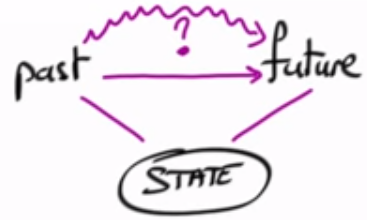
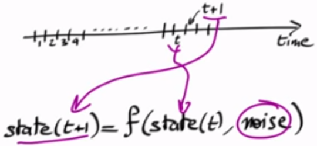
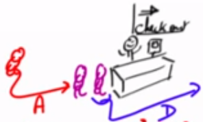
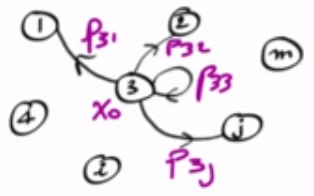
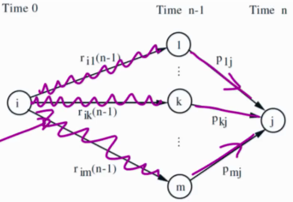
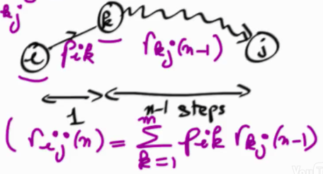
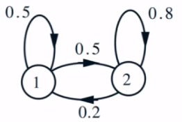
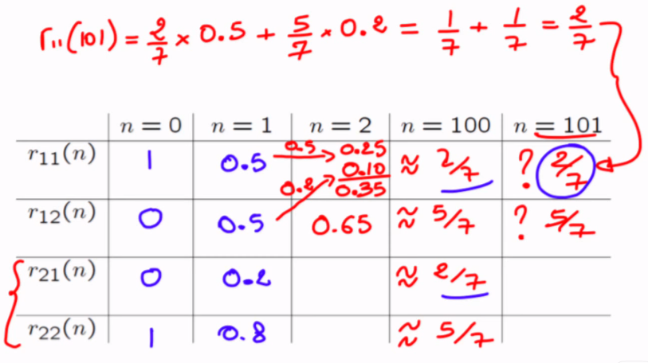
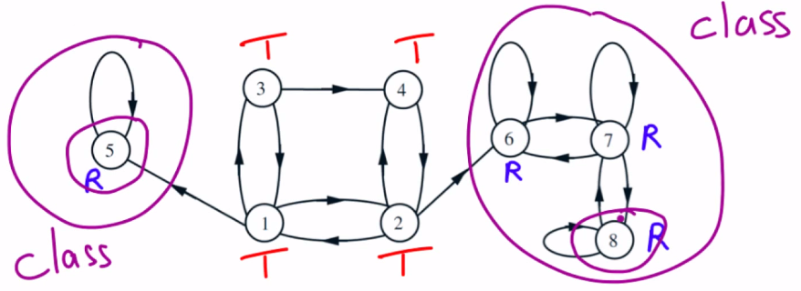

# Finite-state Markov chains

$\newcommand{\cnd}[2]{\left.#1\,\middle|\,#2\right.}$
$\newcommand{\pr}[1]{\mathbf{P}\!\left(#1\right)}$
$\newcommand{\cpr}[2]{\pr{ \cnd{#1}{#2} } }$

## Overview

How do Markov Chains contrast with bernoulli and poisson processes?  
Not memoryless

past and future states are independent conditioned on the present state

checkout counter example

states
transition probabilities
markov property
transition probability graphs
recurrent states
transient states

## Introduction to Markov Processes

works to model situations where the future depends on (and can be predicted by) the past

past and future are linked by state which evolves over time

## Checkout counter example

Imagine a single checkout line with people in line. What are the interesting things that can happen?  
Someone leaves or someone arrives

Assume 1 person is served at a time.

Assume that customer arrivals are distributed according to bernoulli($p$). Then based on the previous unit we know the inter-arrival time will be geometric($p$).

assume that the customer service times are distributed according to geometric($q$)

transition probability graph provides a representation of a discrete time finite state Markov chain model of the example.

The number of people in the queue at each step seems to capture everything we need to know.

restrict the total number of people that can be in the queue to 10. Then there are only 11 possible states, empty through 10.

Let $X_n$ by the number of customers at time $n$.

The sum of the probabilities of the transitions possible from a state is 1.

## Discrete time finite state Markov chains

system divided into discrete time steps.

system starts at time 0 in some initial state and transitions with some randomness to another state at each time step.

state - describes the current situation of a system we are interested in.

$X_n$: state after $n$ transitions. Belongs to a finite state.

The initial state $X_0$ could be fixed or random.

In general the transitions with 0 probability are not shown.

The transition probabilities $p_{ij} = \cpr{X_{n+1} = j}{X_n = i}$ are the conditional probabilities of transitioning to state $j$ from state $i$.

The sum of the probabilities leading from a state is 1.

The chain is time homogenous, i.e. $p_{ij}$ holds for all $n$.

This is all true assuming the Markov property holds:

Because of this property it is important when building any model to ensure that the state captures all necessary state information. There are no recipes but practice allows making better choices.

1. yes because they are independent so any conditional probability will be equal to just the distribution of the variable in the first place
2. yes because you know the distribution of the coins in the box, you are putting the chosen token back in the box so the distribution stays the same. The past does not influence the distribution, only the distribution  of coins in your current box.
4. This isn't about whether we can determine who wins or when it stops, if the state is the amount of money alice has after the $n$th toss. They keep playing until one player goes broke.$X_n$ is the amount of money that alice has after the $n$th toss. she may gain or lose a dollar, this is only dependent on this state and the outcome of the fair coin. If Bob has no dollars then they are not going to toss the coin so there are no transitions from that state.

Alice and Bob take turns tossing a fair coin.
Assume that tosses are independent.
Whenever the result is Heads, Alice gives 1 dollar to Bob
whenever it is Tails, Bob gives 1 dollar to Alice.
Alice starts with A dollars
Bob starts with B dollars, for some positive integers A and B.
They keep playing until one player goes broke.
Let Xn be the amount of money that Alice has after the nth toss.
$X_0$ is fixed at $A$.
$X_n$ is the set of numbers from 0 to $A+B$.
$n$ is from 0 to

it's ok to stop in a state.

## N-step transition probabilities

Markov chains are useful for doing predictions on time series that have some randomness. Like how many people will be in line at a given time.

Notation:
The $n$-step transition probability will be given by
\[
\begin{align}
r_{ij}(n) &= \cpr{X_n = j}{X_0 = i}\\
&= \cpr{X_{n+s} = j}{X_s = i}
\end{align}
\]

The second definition is a result of the time-invariance of our transition probabilities.

How to calculate $r_{ij}(n)$? First we set up some base cases.
\[
\begin{align}
r_{ij}(0) &= \begin{cases}
1, & i = j\\
0, & i \neq j
\end{cases}\\
r_{ij}(1) &= p_{ij}, \forall i, \forall j
\end{align}
\]

Then we consider going from $i$ to state $j$. Suppose there is some state $k$ with $p_{kj} \neq 0$. This is the same as constant regardless of how we got to $k$ by the markov property, so we can write the probability of getting to state $j$ via $k$ as $r_{ik}(n-1)p_{kj}$ as seen in the diagram below.

where the squiggly line is just the undetermined path from $i$ to $k$. Again, the last leg of the journey is really a conditional probability on both $X_{n-1} = k$ and $X_0 = i$, but by the markov property that can be simplified to just $p_{kj}$.

Using this reasoning, we can consider all such probabilities to the $m$ states that lead directly to $j$.

This is an application of the total probability theorem. The probability of getting from $i$ to $j$ in $n$ steps is the probability of getting to some state that connects with $h$ in $n-1$ steps times the probability of those states leading to $j$.

\[
r_{ij}(n) = \sum_{k=1}^m r_{ik}(n-1) p_{kj}
\]

This is recursive in the sense that the inner function $r_{ik}(n-1)$ is calculated in the same way.

A variation is to start at $i$ and traces outwards

If the initial distribution ($X_0$) is itself random, then the state probability distribution after $n$ steps is given by

\[
\pr{X_n=j} = \sum_{i=1}^m\pr{X_0=i}r_{ij}(n)
\]

## A numerical example, part 1

trying to solve for the general case

looking at the example and expanding out

seeing some convergence to a value after a period of time.

This happens regardless of the state that is chosen initially.

When this happens it is the markov chain entering a 'steady state'. The thing that becomes stable is the probability of $X_n$ as $n$ grows large.

Is this always the case for Markov chains?

## Generic convergence questions

Is it true in general that $r_{ij} \to \pi_j$ as $n\to\infty$?

This can be broken into a few questions.

First, is it necessarily true that $r_{ij}(n)$ converge? Notice

We will see that chains without this periodicity do not have convergence problems.

Another question, assuming the markov chain does converge does the limit depend on the initial state?

## Recurrent and transient states

Our purpose is to formalize the notion of states being "accessible" from other states.

Defns:

A state $i$ is *recurrent* if "starting from  $i$, and from wherever you can go, there is a way of returning to $i$"
A state that is not recurrent is called *transient*

A "class" is a set of connected recurrent states. The presence of multiple classes in a markov chain state diagram matters when determining whether the initial state will matter for convergence.
