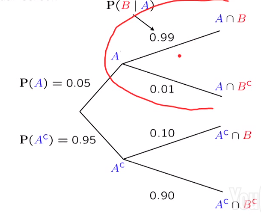
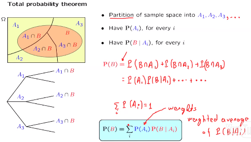

# Lecture 2: Conditioning and Baye's rule

$\newcommand{\pr}[1]{\mathbf{P}\!\left(#1\right)}$
$\newcommand{\cpr}[2]{\mathbf{P}\!\left(#1\,\middle|\,#2\right)}$

## Motivation and Overview

Conditional probabilities are useful for:  
breaking up complex models, divide and conquer

What forms the foundation of the field of inference?  
Conditional probabilities

When is independence useful?  
When probabilistic phenomena are non-interacting

Terms:
1. **conditioning**
2. **independence**

Conditional probability
* Definition
* Motivation

Three tools that use conditional probability
* Multiplication rule
* Total probability theorem
* Bayes rule especially

These tools contain very powerful ideas.

Which rule is the foundation for the field of inference?  
Bayes rule

What is the definition of conditional probability?
\[
\cpr{A}{B} = \frac{\pr{A \cap B}}{\pr{B}}
\]
given $\pr{B} \neq 0$

What motivates our definition of conditional probability?  
Given a set of outcomes in $B$ with certain probability, the set of outcomes in $A$ that are also in $B$ over the total probability of outcomes in $B$ puts the probability of outcomes in $A$ in terms of the total probability of outcomes in $B$ (which includes outcomes not in $A$).

## Dice roll example

showing intersection of cases:

Suppose we have 2 4-sided die. The outcomes are X and Y.

    A := min(X, Y) = 2
    B := max(X, Y) = 3

\[
\cpr{B}{A} = \frac{\pr{B\cap A}}{\pr{A}}
\]

## Conditional probabilities obey probability axioms

Recall:
* Nonnegative
* Normalization
* Additivity of unions

Since conditional probabilities satisfy the probability axioms we can use probability theorems and formulas derived on normal probabilities on conditional probabilities.

What are conditional probabilities used for?  
Revising a model when we get new information.

Ex: Radar detection.

* $A$ - airplane flying above
* $B$ - something registered on radar

The probabilities on the second level of the tree are conditional probabilities, meaning they already take into account the fact that $A$ or $A^c$ occurred.

What is the question here?  
$\pr{A\cap B}$, that something is flying and registered on radar.

Starting with the definition of conditional probability

\[
\begin{align}
\cpr{B}{A} &= \frac{\pr{A\cap B}}{\pr{A}}\\
\pr{A} \cdot \cpr{B}{A} &= \pr{A\cap B}\\
0.05 \cdot 0.99 &=
\end{align}
\]

Total probability of something occurring: "the radar sees something"
\[
\begin{align}
\pr{B} &= \pr{A \cap B} + \pr{A^c \cap B}\\
&= 0.05 \cdot 0.99 + 0.95 \cdot 0.1\\
&= 0.1445
\end{align}
\]

Reversed conditional probability: "if the radar registers something, what is the probability that it was because there was an airplane?"

\[
\begin{align}
\cpr{A}{B} &= \frac{\pr{A \cap B}}{\pr{B}}\\
&= \frac{0.05 \cdot 0.99}{0.1445}\\
&= 0.34
\end{align}
\]

## Multiplication rule

Motivation: Probability of dependent events.

$\cpr{A}{B} = \frac{\pr{A \cap B}}{\pr{B}}$

\[
\begin{align}
\pr{A \cap B} &= \pr{B} \cpr{A}{B}\\
&= \pr{A}\cpr{B}{A}
\end{align}
\]

By association, it's not difficult to come up with the same rule for three probabilities ($\cpr{A}{B, C}$. Thinking about it in terms of a tree as in the last example, this is calculating the individual leaf nodes along some tree

The general formula is

\[
\pr{A_1 \cap A_2 \cap \cdots \cap A_n} = \pr{A_1} \prod_i \cpr{A_i}{A_1 \cap \cdots \cap A_{i-1}}
\]

## Total probability theorem

## Bayes Rule

\[
\cpr{A_i}{B} = \frac{\pr{A_i} \cpr{B}{A_i}}{\sum_j \pr{A_j} \cpr{B}{A_j}}
\]

Imagine being given probabilities as in the radar example. They are provided with likelihood of sensing and then likelihood of true/false positive/negative. So the most straightforward question is, given that there's an airplane, what's the probability that it is sensed. Bayes rule answers the reverse of the straightforward question. Given that something was sensed, what's the probability that an airplane is flying.

\[
\frac{\text{weighted probability of $B$ occurring under $A_i$}}{\text{total probability of $B$ in any situation}}
\]

So given that $B$ occurred, the probability that $A_i$ occurred is the intersection of $A_i$ and $B$ over the total probability given in $B$.

These are all ways to work with information when you have an incomplete picture, or because it doesn't make sense to enumerate every possible combination of things you may want to know.

Forms the foundation of Bayesian inference which allows us to update our beliefs as new evidence comes in.
