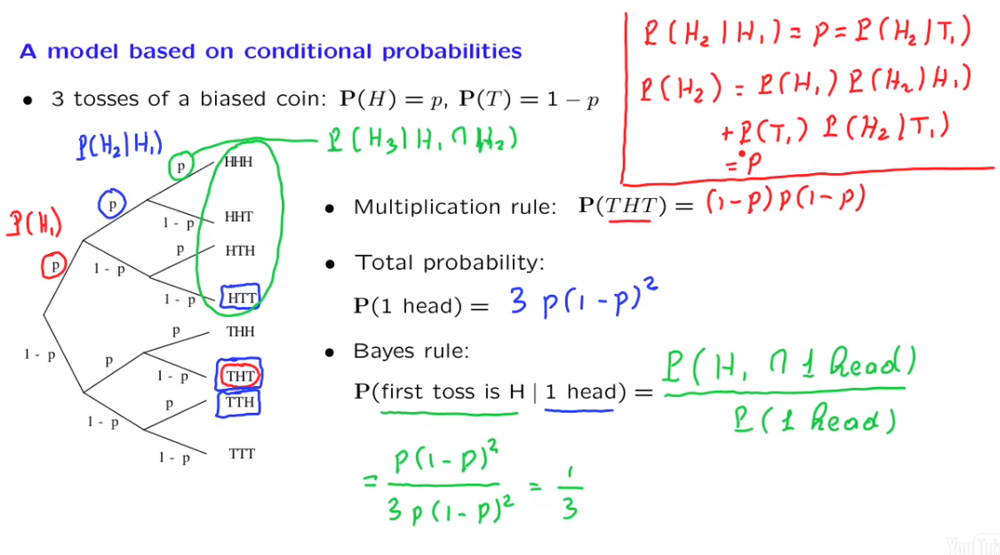
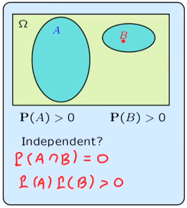
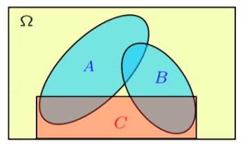
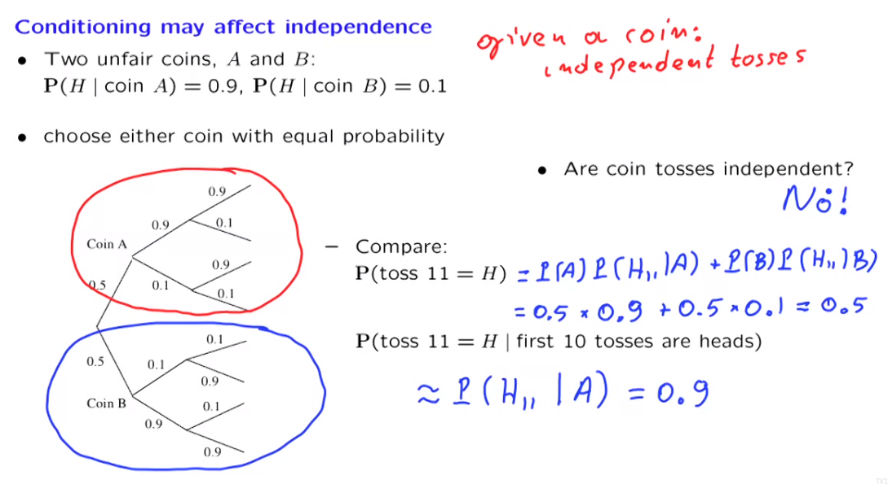
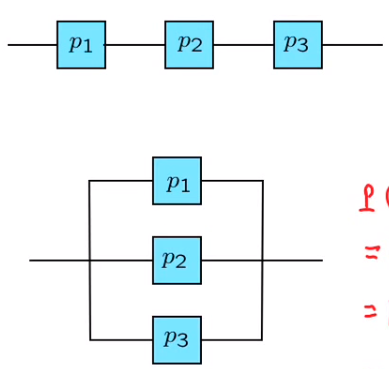
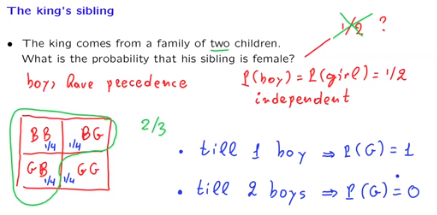

@import "../lib/macros.md"

# Lecture 3: Independence

## Overview

What is independence?
When the conditional and unconditional probabilities between two events are the same.

Focus
* intuition about the meaning of independence
* conditional independence
* independence of a collection
* reliability analysis
* word of caution

## Motivating example for independence

1. The expression next to each branch gives the conditional probability for that branch.

What is special about the conditional probabilities for events in the diagram?
They are the same regardless of the condition that led to that point.

Total probability is the same and the probability is the same regardless of the prior.

What is the intuitive definition of independence?
\[
\cpr{B}{A} = \pr{B}
\]

Notice
\[
\begin{align}
\pr{A \cap B} &= \pr{A} \cpr{B}{A}\\
&= \pr{A}\pr{B}
\end{align}
\]

What is the formal definition of independence? Why do we use it instead of the intuitive definition?
\[
\pr{A \cap B} = \pr{A} \cdot \pr{B}
\]
* it is symmetric with respect to $A$ and $B$
* it implies the reverse of the intuitive definition: $\cpr{A}{B} = \pr{A}$
* applies even if $\pr{A} = 0$

Notice that these are not independent even though they are non-intersecting.

Non-intersecting sets seem to be isolated from each other, but that doesn't mean that knowledge of one doesn't give us knowledge of the other.

Where does independence have a place in the real world?
Whenever events result from distinct physical and non-interacting processes, or numerical accident.

// TODO: brush up on reflexive, transitive, symmetric, coreflexive

Theorem: If $A$ and $B$ are independent, then $A$ and $B^c$ are independent.

Prf: If the non-occurrence of $B$ gave you information about the occurrence of $A$, then the occurrence of $B$ would likewise give you information, which is a contradiction.

Also a formal proof exists.

What is conditional independence?
Given some $C$, some values are independent under the probability law $\cpr{\cdot}{C}$.

e.g. $\cpr{A \cap B}{C} = \cpr{A}{C} \cpr{B}{C}$

Independence does not imply conditional independence, as in the above example. Because $A$ and $B$ do not have an intersection in $C$, there is information provided when you know that $C$ occurred because then either $A$ occurred or $B$ occurred but not both.

Given $A$ and $B$ are conditionally independent in $C$, are $A$ and $B^c$ conditionally independent?
Yes, the conditional model is just a probability model and the fact that the complement is independent holds.

Given $A$ and $B$ are conditionally independent in $C$, are they conditionally independent given $C^c$?
Not necessarily, they may have no intersection in $C^c$.

Conditioning may affect independence, because the condition itself may impart some knowledge.

## Independence of a collection of events

Intuitively, information on some of the events does not change the probabilities related to the remaining events.

Defn: Events $A_1, A_2, \dots, A_n$ are independent if: $\pr{A_i \cap A_j \cap \cdots \cap A_m} = \pr{A_i}\pr{A_j}\cdots\pr{A_m}$ for any distinct indices $i, j, m$

Pairwise independence is necessary but not sufficient, we also need all intersections of subsets of the set of events.

## Independence vs pairwise independence

Example:

2 fair coin tosses. The possible events are $\{H_1, H_2, T_1, T_2\}$. Add another event $C$ which contains the outcomes that the two tosses had the same result: $\{HH, TT\}$.

How do you check for pairwise independence?
Take each combination of events and calculate whether $\pr{A_1 \cap A_2} = \pr{A_1}\pr{A_2}$. It turns out in this example that all sets have pairwise independence.

How do you check for independence of some set?
Enumerate the possible subsets and test that $\pr{\text{intersection of events}} =$ product of probabilities of individual events.

How do you check for independence (i.e. independence of the collection)?
Check that all possible intersections of events are independent. It turns out that this is not true, since knowing $H_1, H_2$ gives you $C$.

You can also think about independence as whether the conditional probability of an event changes from its general probability.

## Reliability

Why is independence a powerful property?
It allows breaking up of complex probabilities.

// TODO: What is a "complex probability"?

Reliability example:
Circuit of units that have a specific failure rate. The question is the probability that the circuit is up, that there is a path from one side to another.

Using de morgan's laws in conjunction with knowing that the complement of a probability $P$ is $1-P$.

## The king's sibling

This problem is a warning to consider all assumptions. The statement that the king comes from a family of 2 children is important because the reason for having 2 children can impact the probability determined at the end.
