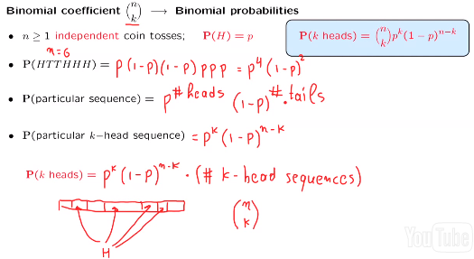
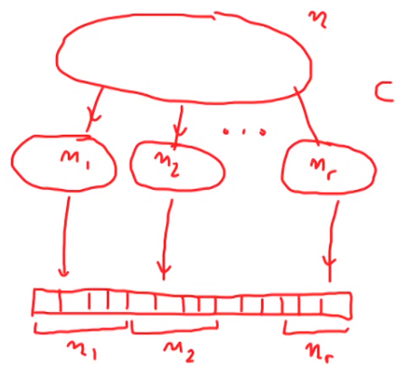
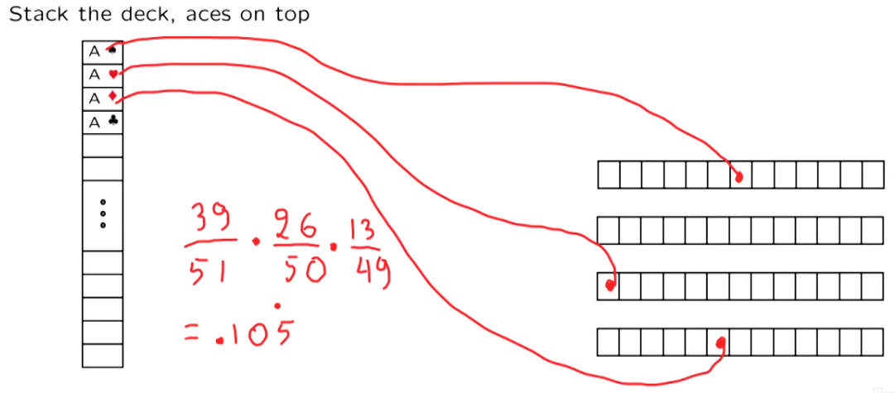

# Lecture 4: Counting

$\newcommand{\pr}[1]{\mathbf{P}\!\left(#1\right)}$
$\newcommand{\cpr}[2]{\mathbf{P}\!\left(#1\,\middle|\,#2\right)}$

## Overview

Focus:
Develop methods for counting number of elements of a set described in some implicit way.

Tools:

* Basic counding principle
* permutations
* subsets
* combinations
* partitions

## The basic counting principle

Given $r$ stages for constructing some object, and $n_i$ ways of constructing the object, how many ways are there of constructing the object?

$\prod_i n_i$

The number of possible decisions are the
### Permutations

Number of possible subsets of a set can be found by considering the sequence of elements indexed by $\{1, 2, \dots, n\}$. We can either choose or not each element, so there are $2^n$ possible ways.

When considering a solution to a counting problem, try to come up with a sequential method for producing a string or choice of the desired form.

Discrete uniform probabilistic model.

Before we can proceed on calculating a probability we need to select a probabilistic model. The assumption that all outcomes of some event are equally likely implies...
A discrete uniform probabilistic model.

## Combinations

$\binom{n}{k}$ - number of $k$-element subsets of a given $n$-element set

$$
\binom{n}{k} = \frac{n!}{k! (n-k)!}
$$

What happens at some extremes of this formula? What happens for $\binom{n}{0}$ and $\binom{n}{n}$?
1 and 1

What convention exists concerning factorials that simplifies things?
$0! = 1$

Some simplifications can make expressions involving binomial corefficients easier to simplify. For example, we know that the number of subsets of a set of size $n$ is equal to $2^n$, so a simplification of

$$\sum_{k=0}^n \binom{n}{k} = 2^n$$

It's also useful to think about executing choices in a different order and seeing the outcomes.

## Binomial probabilities

Binomial probabilities are related to binomial probabilities, an example being a **coin-tossing model**. This is one where you ask a question like what the probability of getting $k$ heads is in $n$ coin tosses where $\pr{H} = p$.

Make sure to pay attention to what a problem is asking, and don't just jump into trying to manipulate some expression without seeing how to move around the ideas first.

Example: Given that there were 3 heads in 10 tosses, what is the probability that the first two tosses were heads?

Before anything, state assumptions of independence and $\pr{H} = p$.

Two approaches:
1. Work from the definition of conditional probability and simplify using the previously-derived formula for the probability of a number of heads.
2. We restrict focus to the set of 10 tosses with 3 heads $B$ and notice that the conditional probability law on $b$ is uniform (since conditioning doesn't change probabilities). As a result, we can get the probability of $A$, that the first 2 tosse were heads, y counting.

We work inside a conditional universe and that allows us to use counting.

The reason we can use counting is due to the conditional universe having a uniform probability law on it.

## Partitions

Given $n \ge 1$ distinct items and $r \ge 1$ persons, given $n_i$ items to person $i$.

* $n_1, \ldots, n_r$ are nonnegative integers.
* $n_1 + \dots + n_r = n$

Similar to the previous computation, we assume we know the value we want, $c$ the number of ways items could be distributed to $r$ people.

Imagine that we do this distribution and then ask each person to order their items and place it into a list consecutively. Then all possible combinations are generated. But we know that the number of ways of ordering n items is $n!$ so we have the equation: $cn_1!n_2!\cdots n_r! = n!$. Thinking about multiplication as the way to calculate the number of cases given $x_i$ decisions at each point helps to realize this equality.

Number of partitions $c$:

$$
c = \frac{n!}{n_1!n_2!\cdots n_r!}
$$

which is the multinomial coefficient, which generalizes the binomial coefficient. This is because the binomial coefficient is for $r = 2, n_1 = k, n_2 = n - k$.

What is the multinomial coefficient?

What implies that we can solve a probability question by counting?
A discrete uniform probability model can be used.

### Distributing cards example

