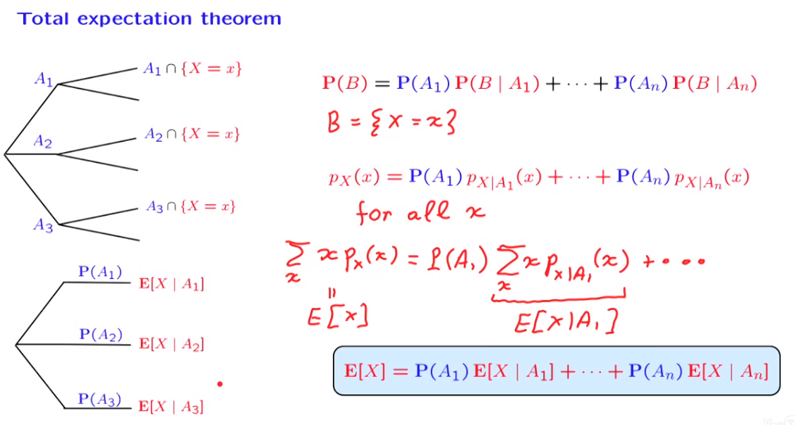
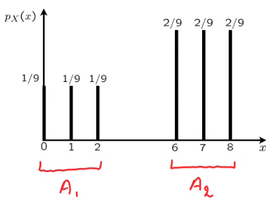
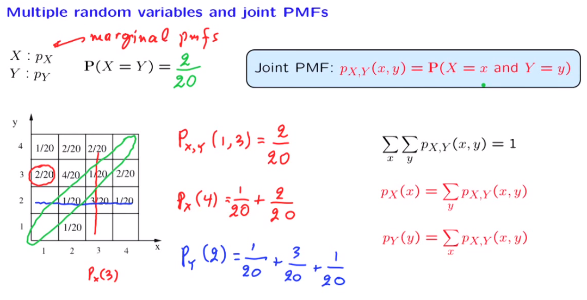
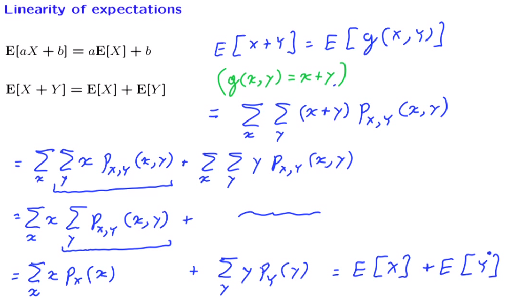
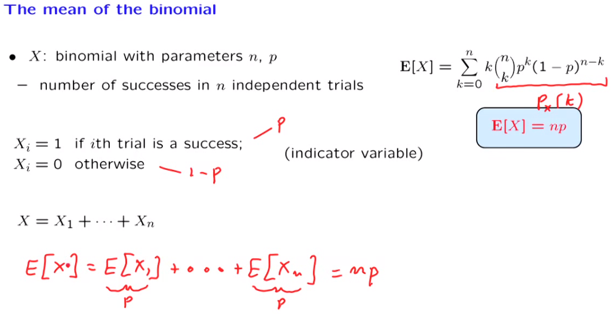

@import "../lib/macros.md"

# Lecture 6: Variance; Conditioning on an event; Multiple r.v.s

## Overview

* Variance and its properties
	* Variance of the bernoulli and uniform PMFs
* Conditioning a r.b. on an event
	* Conditional PMF, mean, variance
    * Total expectation theorem
* Geometric PMF
	* Memorylessness
	* Mean value
* Multiple random variables
	* Joint and marginal PMFs
	* Expected value rule
	* Linearity of expectations
* The mean of the binomial PMF

## Variance

Variance measures the spread/dispersion of a PMF

What question does the variance arise as the answer to?
"How do we get some kind of average distance from the mean?""

Why do we calculate the average distance from the mean in the way we do?
Because using the plain distance from the mean wouldn't be fruitful:
$\ex{X - \mu} = \ex{x} - \mu = \mu - \mu = 0$

What is the definition of the variance? <- this is a big definition
$\var{X} = \ex{(X - \mu)^2}$

How do we calculate with the variance?
$\var{X} = \ex{g(x)} = \sum_x(x-\mu)^2p_X(x)$
for each $x$ calculate the squared distance and weigh against the probability of that $x$.

What is difficult about working with the variance?
It is in the wrong units.

Standard deviation $\sigma_X = \sqrt{\var{X}}$ <- in the right units.

> Notation $\mu = \ex{X}$

Properties of variance:
The variance is not linear, but does have some straightforward properties.

$\var{aX + b} = a^2\var{X}$. This is because a translation doesn't change dispersion (and in the formula itself the $b$s cancel), and the expectation is linear.

Useful formula:
$\var{X} = \ex{X^2} - \left(\ex{X}\right)^2$

> Remember in calculations that $\mu = \ex{X}$

## Variance of the Bernoulli and the uniform

Variance of the Bernoulli, by calculation, is $p(1-p)$

Variance as the measure of randomness of a r.v.

For a uniform r.v. from 0 to $n$:
$\var{X} = \ex{X^2} - (\ex{X})^2 = \frac{1}{n+1} \overbrace{\left(0^2 + 1^2 + 2^2 + \ldots + n^2\right)}^{\frac{1}{6}n(n+1)(2n+1)} - \left(\frac{n}{2}\right)^2 = \frac{1}{12}n(n+2)$

For a uniform random variable from $a$ to $b$ just take the position that $n = b - a$ and so continue that way.

## Conditional PMFs and expectations given an event

Ordinary | Conditional
---|---
$p_X(x)=\pr{X = x}$ | $p_{X\|A}(x) = \cpr{X=x}{A}$
$\sum_x p_X(x) = 1$ | $\sum_x p_{X|A}(x) = 1$
$\ex{X} = \sum_x x p_X(x)$ | $\cex{X}{A} = \sum_x x p_{X|A}(x)$
$\ex{g(X)} = \sum_x g(x) p_X(x)$ | $\cex{g(X)}{A} = \sum_x g(x) p_{X|A}(x)$

> Symmetry of uniform random variables implies midpoint is expected value.

Calculating under a conditional model is just a matter of doing the calculation in the usual way.

Variance of some conditional probability can be larger or smaller than the unconditional probability.

# Total Expectation Theorem

Why are conditional probabilities important?
They allow us to divide and conquer, splitting complicated probability models into simpler sub-models that we can analyze one at a time.

How to use total expectation theorem to divide and conquer problems?

To apply total expectation theorem to calculate the expected value of this, divide into two cases, $A_1$ and $A_2$. Then, notice the following:
\[
\begin{align}
\pr{A_1} &= \frac{1}{3}\\
\pr{A_2} &= \frac{2}{3}\\
\cex{X}{A_1} &= 1\\
\cex{X}{A_2} &= 7\\
\ex{X} &= \frac{1}{3}\cdot 1 + \frac{2}{3} \cdot 7
\end{align}
\]

So it is just the

# Geometric PMF and conditional PMFs

Memorylessness is a property we are adding.

$X$ is geometric with parameter $p$.

Imagine an experiment where the first coin toss occurred and then you are asked to complete the remaining coin tosses until getting heads. Memorylessness is the property that the number of remaining coin tosses, conditioned on Tails in the first toss, is geometric with parameter $p$.

Conditioned on $X > 1$, $X - 1$ is geometric with parameter $p$.

So we ask a question like what is the probability $\cpr{X - 1 = 3}{X > 1}$? That is equal to $\cpr{T_2 T_3 H_4}{T_1} = \pr{T_2 T_3 H_4}$ because coin tosses are independent. $= (1-p)^2p = p_X(3)$

calcilated the PMF of $X-1$ in a conditional universe where $X>1$.

You can generalize the argument to
\[
p_{X-1|X>1}(k) = p_X(k)
\]

Conditioned on $X > n, X - n$ is geometric with parameter $p$.

The conditional PMF on the remaining tosses will remain the same.

The mean of the geometric PMF comes from both the Memorylessness property of the PMF along with the total expectation theorem.

Why don't we argue for the mean of the geometric PMF from the definition?
Because
\[
\ex{X} = \sum_{k=1}^\infty kp_X(k) = \sum_{k=1}^\infty k(1-p)^{k-1}p
\]
which is difficult to solve.

\[
\begin{align}
\ex{X} &= 1 + \ex{X - 1}\\
&= 1 + p\cex{X-1}{X=1} + (1-p)\cex{X-1}{X>1}\\
&=1 + 0 + (1-p)\ex{X}
\end{align}
\]

Then solving the equality gives $\ex{X} = \frac{1}{p}$

This illustrates the fact that difficult calculations can be made much more simple if broken down in a clever way.

# Joint PMFs and the expected value rule

Distribution of multiple random variables at a time

Given two random variables and their PMFs, $X, Y$, it's not possible to say anything about probabilities involving both of them without their joint PMF.

What kind of question might you want to know the answer to?
$P(X = Y)$

What is the joint PMF?
$p_{X, Y}(x, y) = \pr{X = x \text{ and } Y =y}$

What is a marginal PMF?
The original PMF of two random variables.

Once we have the joint PMF we can calculate anything about the marginal PMFs by summing across the original variable.

The same idea holds for $n$ random variables.

The sub-scripts tell us what variables we are talking about.
The probability across the whole space adds to 1.

For more than two variables it's also reasonable to ask questions like $p

Functions of multiple random variables:

Given a function (which is also a random variable) $X = g(X, Y)$ we can define its PMF: $p_Z(z) = \pr{Z = z} = \pr{g(X, Y) = z}$. If we let $U = \setst{(x, y)}{g(x, y) = z}$ then it is equal to $\sum_{(x, y) \in U} p_{X, Y}(x, y)$.

The expected value rule for two probabilities:
\[
\ex{(X, Y)} = \sum_x\sum_y g(x, y) p_{X, Y}(x, y)
\]

# Linearity of expectations and the mean of the binomial

Derivation of $\ex{X + Y} = \ex{X} + \ex{Y}$

This works for any finite number of random variables
\[
\ex{X_1 + \cdots + X_n} = \ex{X_1} + \cdots + \ex{X_n}
\]

Using linearity property to solve a hard problem

Let $X$ be a binomial r.v. with parameters $n$ and $p$, the number of successes in $n$ independent trials.

I'm missing something here, I think he just went back to the original definition of binomial and broke it up into the individual n trials.

This was much simpler than just approaching the sum directly but I need to think through the binomial r.v. to understand it fully.
