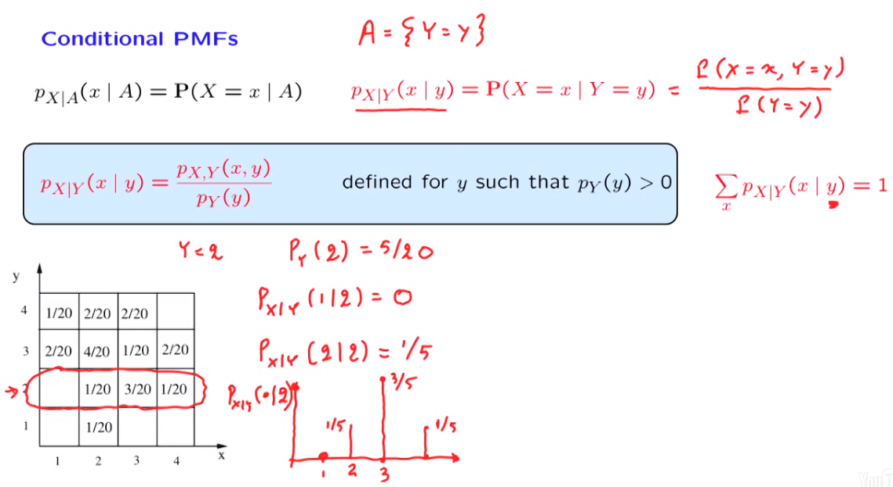
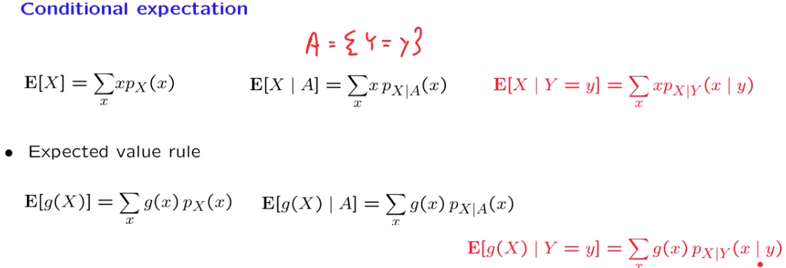
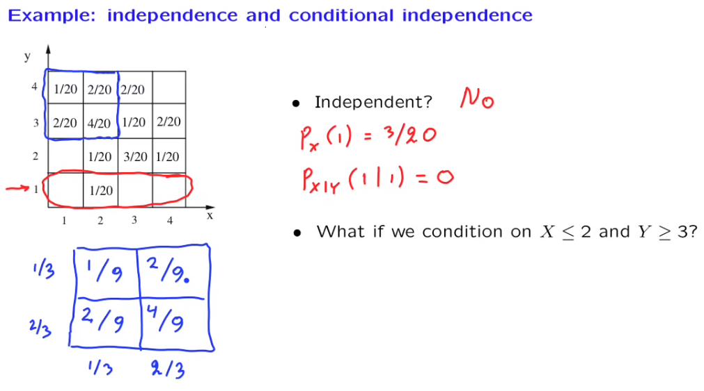
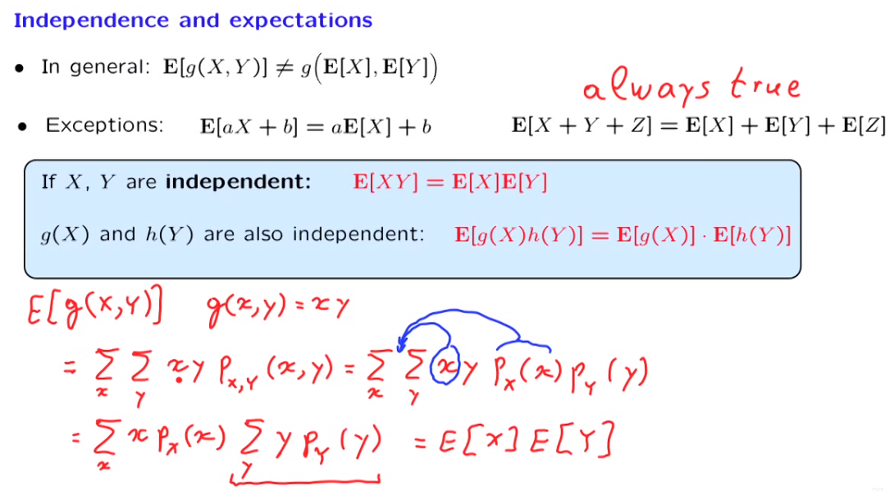

@import "../lib/macros.md"

# Lecture 7: Conditioning on a random variable, independence of random variables

## Overview

* Conditional PMFs
    * Conditional expectations
    * Total expectation theorem
* Independence of r.v.s
    * Expectation properties
    * Variance properties
* The variance of the binomial
* The hat problem: mean and variance

Connections:
* unit 2 lecture 2 - conditioning with probabilities

At a high level, conditional PMFs are just like conditional probabilities. We look at how probabilities change when we know that some random other random variable takes on a specific value or a set of specific values.

We derive the conditional PMF using the equality for conditional probabilities, $\cpr{X}{A} = \frac{\pr{X \cap A}}{\pr{A}}$.

In the slice of the 4x4 space above, the entries have the same relative values as they did in the unconditional case ((2, 2) is still as likely as (4, 2) and a third as likely as (3, 2)). The difference with the PMF is that dividing by the probability of $A$ scales it so that it's sum over all values is equal to 1, as required.

Similar to with conditional probabilities, there is a symmetric multiplication rule for conditional PMFs:

\[
\begin{align}
p_{X,Y}(x, y) &= p_Y(y)p_{X|Y}(x|y)\\
p_{X,Y}(x,y) &= p_X(x)p_{Y|X}(y|x)
\end{align}
\]

This multiplication rule gives us a relationship between the joint PMF and a regular and conditional PMF.

PMFs with more than two r.v.s
\[
p_{X|Y,Z}(x|y,z) = \cpr{X=x}{Y=y,Z=z}
\]

> If a variable isn't bound then it doesn't necessarily make the statement syntactically incorrect, it just means an expression is a function of the unbound variables.

## Conditional expectations

In these cases as we move from previous results to full multivariable functions of random variables, we consider the case where an event is actually a random variable being some specific value.

## Total probability and expectation theorems

Given $A_1,\ldots, A_n$ that partition $\Omega$, let $Y = \{y_1, \ldots, y_n\}$ and $A_i = \{Y = y_i\}$. Let $X$ be a r.v. and consider the PMF of $X$

\[
\begin{align}
\pmf{X}{x} &= \pr{A_1}\cpmf{X}{A_1}{x} + \cdots + \pr{A_n}\cpmf{X}{A_n}{x}\\
&= \color{red}{\sum_y \pmf{Y}{y}\cpmf{X}{Y}{\cnd{x}{y}}}
\end{align}
\]

What about the expected value of $X$?

\[
\begin{align}
\ex{X} &= \pr{A_1}\cex{X}{A_1} + \cdots + \pr{A_n}\cex{X}{A_n}\\
&= \color{indigo}{\sum_y \pmf{Y}{y}\cex{X}{Y=y}}
\end{align}
\]

Fine print: This is also valid when $Y$ is a discrete r.v. that ranges over an infinite set, as long as $\ex{\abs{X}} < \infty$.

The usefulness of these theorems is that it can be used to divide and conquer complicated models.

## Independence of random variables

Tracing independence from our original understanding in terms of events through to an interpretation in terms of random variables.

In the real world independence is used to model situations where each of the random variables is generated in a decoupled manner, in a separate probabilistic experiment and these experiments do not interact with each other and have no common sources of uncertainty.

Intuitively, a deterministic r.v. does not provide information about non deterministic r.v.s

## Example: independence and conditional independence

We do have independence in the blue universe, checked by looking at whether the joint PMF factors as a product of marginal PMFs.

## Independence and expectations

## Independence, variances, and the binomial variance

<!-- TODO -->
