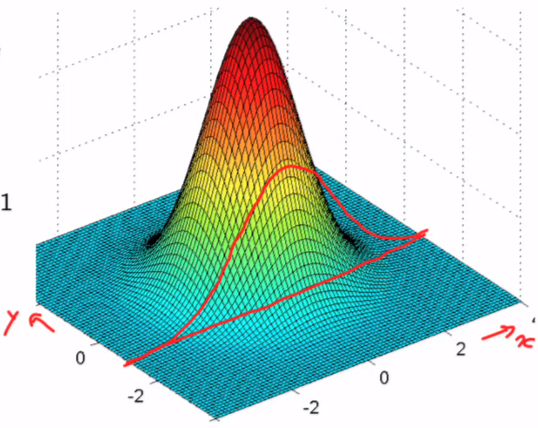
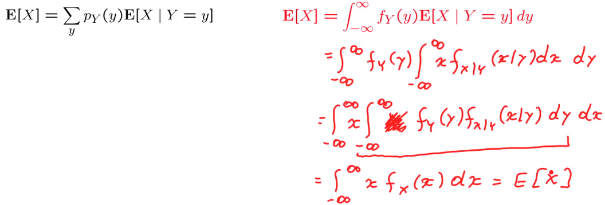
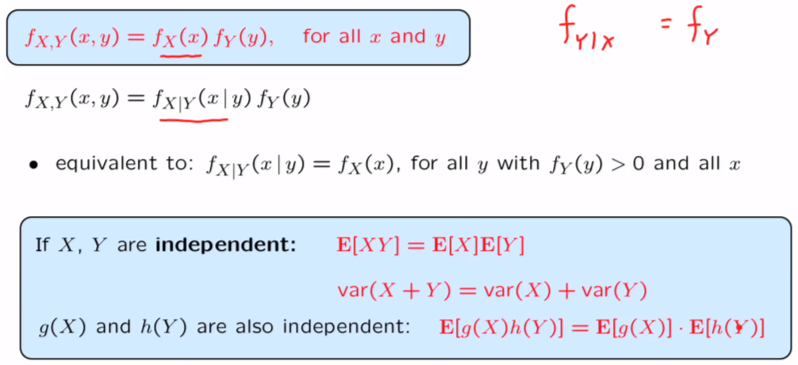
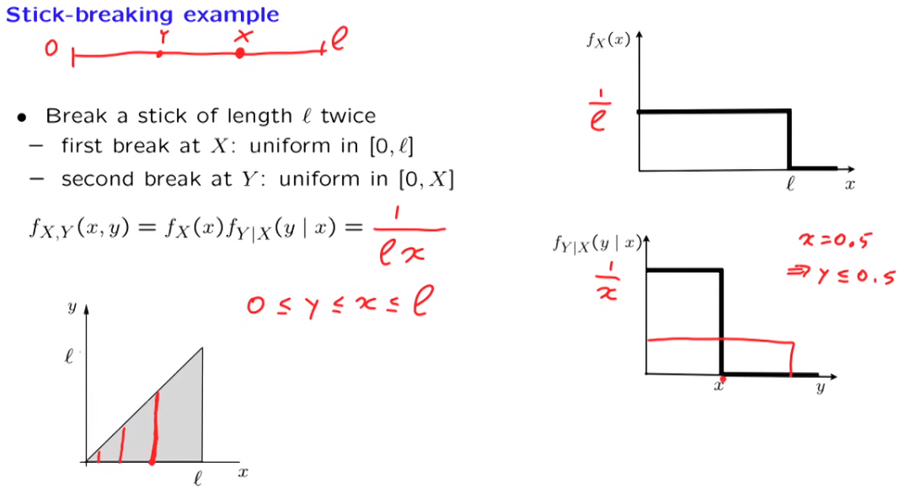
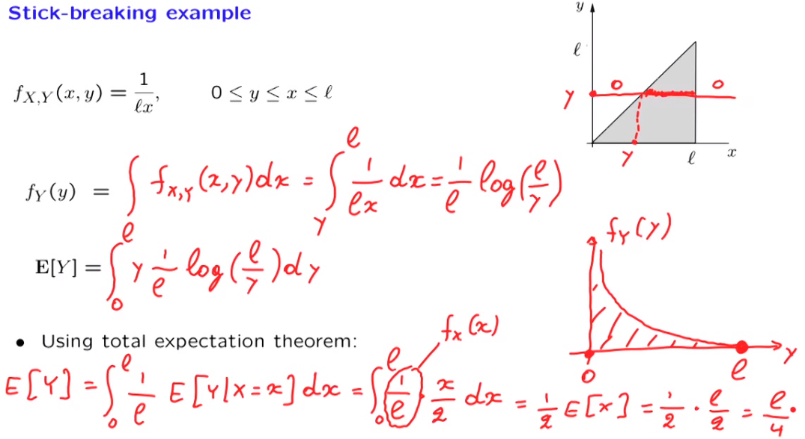
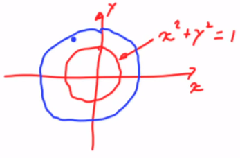
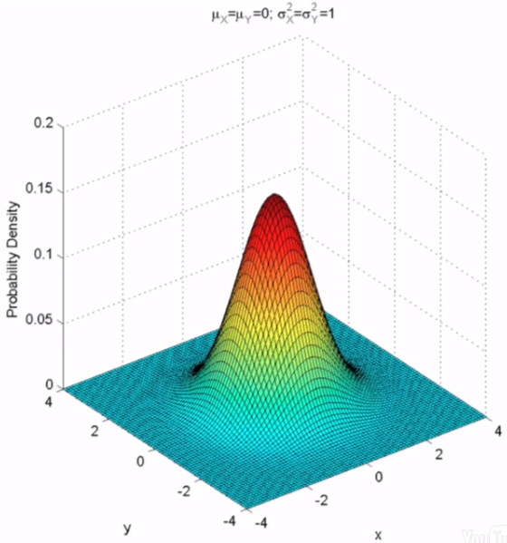
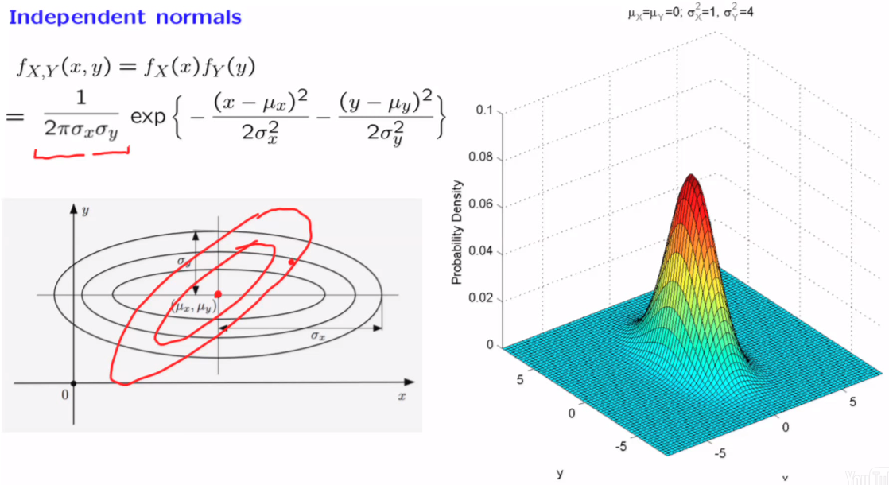

# Lecture 10: Conditioning on a Random Variable, Independence, Bayes' Rule

$\newcommand{\cnd}[2]{\left.#1\,\middle|\,#2\right.}$
$\newcommand{\pr}[1]{\mathbf{P}\!\left(#1\right)}$
$\newcommand{\cpr}[2]{\pr{ \cnd{#1}{#2} } }$
$\newcommand{\setst}[2]{\left\{#1\,\middle|\,#2\right\}}$
$\newcommand{\ex}[1]{\mathbf{E}\left[#1\right]}$
$\newcommand{\cex}[2]{ \ex{ \cnd{#1}{#2} } }$
$\newcommand{\var}[1]{\text{var}\left(#1\right)}$
$\newcommand{\d}{ \text{d} }$
$\newcommand{\iint}[2]{ \! #1 \,\d #2 }$
$\newcommand{\pmf}[2]{ p_{ #1 }\left( #2 \right) }$
$\newcommand{\cpmf}[3]{ \pmf{ \cnd{#1}{#2} }{#3} }$
$\newcommand{\pdf}[2]{ f_{ #1 }\left( #2 \right)}$
$\newcommand{\cpdf}[3]{ \pdf{ \cnd{ #1 }{ #2 } }{ #3 } }$
$\newcommand{\if}{\text{if }}$
$\newcommand{\exp}{\text{exp}}$
$\DeclareMathOperator{\exp}{exp}$

## Overview

* Conditioning $X$ on $Y$, especially when using
  * Total probability theorem
  * Total expectation theorem
* Independence
  * Independent normals
* A comprehensive example
* Four variance of Bayes rule - foundation of inference.

## Conditional PDFs

What is the problem with going directly from the definition of conditioning on PMFs to conditioning on PDFs?  
The specific values used in the discrete case have 0 probability in the continuous case.

To build up an intuition, we start with the probability that $X$ takes a value in some neighborhood of $x$ conditioned on $A$.

we take $A$ to be some neighborhood of $y$.
Then this becomes
\[
\cpr{x \le X \le x + \delta}{y \le Y \le y + \epsilon} \approx \frac{\pdf{X,Y}{x, y}\delta\epsilon}{\pdf{Y}{y}\epsilon} = \cpdf{X}{Y}{\cnd{x}{y}}\delta
\]

The probability of a small interval is equal to the PDF times the small interval. Interpretation of the conditional PDF in terms of probabilities of small intervals.

This isn't limited to small intervals. In general for continuous random variables:
\[
\cpr{X\in A}{Y = y} = \int_A \iint{ \cpdf{X}{Y}{\cnd{x}{y}} }{x}
\]

One potential problem here is that the $Y = y$ probability is technically 0 and we can't condition on zero probability events, but we can bypass that by just defining the right side to be the value of the left side, since the value on the right is well-defined.

Subtleties aside, we will treat these PDFs in the same way as all the others, just calculating using conditional PDFs instead of regular ones.

Get a grip on conditional PDFs:

First, notice that $\cpdf{X}{Y}{\cnd{x}{y}} \ge 0$.

Think of $Y$ as fixed at some $y$. The shape of $\cpdf{X}{Y}{\cnd{\cdot}{y}}$ is a slice of the joint pdf.

The value of the denominator is exactly that value required to scale the integral to 1.

and we have a similar multiplication rule

It all looks the same algebraically but it means something different because these are densities and not probabilities.

## Total probability and total expectation for continuous values

Derivation of the expected value of $X$.

Expected value rules from the discrete case also hold for the continuous case, just interchange sums for integrals and PMFs for PDFs.

## Independence

No matter what value of $Y$ is observed, the distribution of $X$ does not change as a cross-section.

TODO: Continuous vs jointly continuous?

Given independent jointly continuous random variables like $X, Y, Z$, having functions like $g(X, Y)$, $h(Y, Z)$ are dependent because they both depend on $Y$.

## Stick-breaking example

Uses everything we've got in our hands.
* Joint PDFs, marginal PDFs, calculating marginals, calculating expectations, conditional expectations, total expectation theorem.

Are $X$ and $Y$ independent?  
No. If you change $x$ then the conditional PDF of $Y$ would be different, but with independence all the values have to be the same.

The value of a vertical slice of the joint PDF is constant, but as the values of $x$ decrease, the size of each slice increases.

## Independent standard normals

Looking at the joint PDF of independent normal random variables. By independence, we have
\[
\begin{align}
\pdf{X,Y}{x, y} &= \pdf{X}{x} \pdf{Y}{y}\\
&= \frac{1}{\sqrt{2 \pi}} \exp\left\{-\frac{x^2}{2}\right\} \cdot \frac{1}{\sqrt{2 \pi}} \exp\left\{-\frac{y^2}{2}\right\}\\
&= \frac{1}{2 \pi} \exp\left\{-\frac{1}{2} \left(x^2 + y^2\right)\right\}
\end{align}
\]

Notice that around circular regions $x^2 + y^2$ will have a constant value, plotted this looks like:

which are the contours of the joint PDF, which looks like

Generalizing to the case of non-standard normals, the joint PDF takes the following form which is just an ellipse around the means. It varies along the $x$ and $y$ axes.

