@import "../lib/macros.md"

# Lecture 9: Conditioning on an event; Multiple r.v.'s

## Overview

* Conditioning a r.v. on an event
  * Conditional PDF
  * Conditional expectations
  * Exponential PDF
  * Total probability and expectation theorem
  * Mixed distributions
* jointly continuous r.v.'s and joint PDFs
  * From the joints to the marginals
  * uniform joint PMF example
  * Expected value rule and linearity of expectations
  * The joint CDF

Connections:
* unit 4 lecture 7 - conditioning on a random variable

Building up the same kind of tools for working with and breaking down probabilities that was done in the discrete case.

## Conditional PDFs

What do we need to assume about the conditioning event in a conditional probability in order for it to be well-defined?
That it is positive.

Comparison of discrete and continuous conditionings:

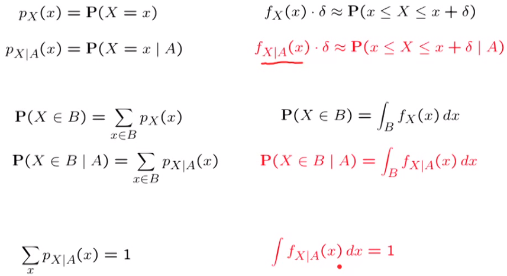

What is the definition of a conditional PDF?
\[
\cpr{X\in B}{A} = \int_B \iint{ \cpdf{X}{A}{x} }{x}
\]

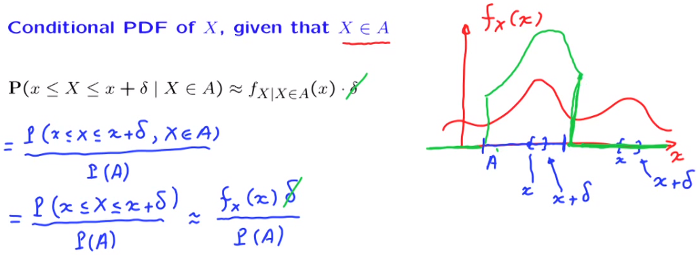

\[
\cpdf{X}{X\in A}{x} = \begin{cases}
0,                         & \if x \not\in A\\
\frac{ \pdf{X}{x} }{ \pr{A} }, & \if x \in A
\end{cases}
\]

The scaling factor requires so that the area under the curve

maintain the same relative sizes as the unconditional probabilities.

Comparison between discrete and continuous cases:

Conditional expectation of $X$, given an event.

> TODO: complete table or use some better math mode

discrete | continuous
--|--
$\ex{X} = \sum_x x\pmf{X}{x}$ | $\ex{X} = \int\iint{ x \pdf{X}{x} }{x}$
$\cex{X}{A} = \sum_x x\cpmf{X}{A}{x}$ | $\cex{X}{A} = \int\iint{ x \cpdf{X}{A}{x} }{x}$

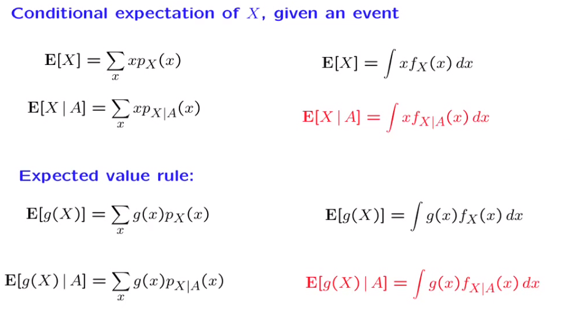

Same as in the discrete case, just with integrals instead of summations.

So to calculate you have to get the probability of $A$ which in the context of a continuous r.v. is probably an integral over the set $A$.

Calculating the variance can be done much more easily using the equality with expectations.

Sometimes there's not a point to evaluating integrals.

## Memorylessness of the exponential PDF

Example:
You have a light bulb whose lifetime is described by an exponential r.v. $T$ with parameter $\lambda$.

The question is whether you should prefer a new or used "exponential" light bulb.

The answer will be given by comparing the probabilities:
1. A new lightbulb lasts time $x$, and
2. A lightbulb used for time $t$ will last time $x$

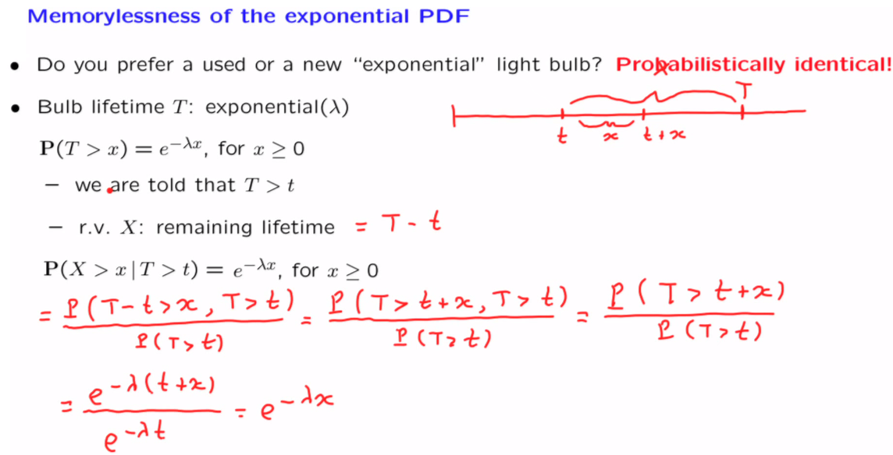

And it turns out these are the same.

Given the conditional PMF $\pdf{T}{x} = \lambda e^{-lambda x}$, for $x \ge 0$, we consider the probability that the lifetime falls in some time $\delta$.

\[
\begin{align}
\pr{0\le T \le \delta} &\approx \pdf{T}{0}\cdot\delta\\
&= \lambda\delta
\end{align}
\]

By Memorylessness, even if we start at some other time $t$, $\cpr{t \le T \le t + \delta}{T > t} = \pr{0 \le T \le \delta} = \lambda \delta$. So for each $\delta$ step there is some $\lambda \delta$ probability that the bulb will fail in the next step, similar to coin flips in the geometric r.v. This will be the foundation for the Poisson process later on.

## Total probability and expectation theorems

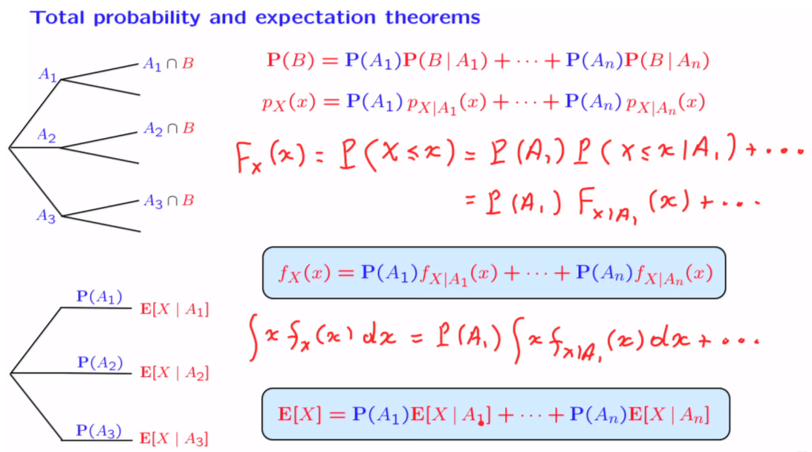

Starting with the CDF and taking the derivative of both sides we arrive at the total probability theorem. Multiplying both sides by $x$ and integrating gives us the total expectation theorem. Both have the same interpretation as a weighted sum of the output of the corresponding PDFs and expectations against the probability of the input falling into each one of the events $A_i$.

Example:
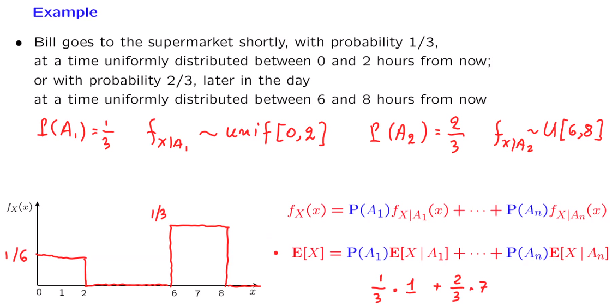

Given descriptions of individual events they can be combined using total probability and total expectation to get an overall picture of the probability and the total expected value. For the graph, the work of determining how tall to make each section is done for us by splitting between the two given probabilities (because otherwise the height of the uniform probabilities would be 1/2).

This is also great for overlaps in time because then it has the increased probability where needed.

## Mixed distributions (discrete and continuous)

How can a distribution be neither discrete nor continuous?
By violating properties of both, e.g.
\[
X = \begin{cases}
\text{uniform on } [0, 2], &\text{with probability } \frac{1}{2}\\
1, &\text{with probability } \frac{1}{2}
\end{cases}
\]

$X$ is not discrete because it has a continuous part. $X$ is not continuous because it has a specific nonzero value for a single input, $\pr{X = 1} = \frac{1}{2}$.

What do we use to handle mixed distributions?
CDF - it is well-defined for all sorts of probabilities.

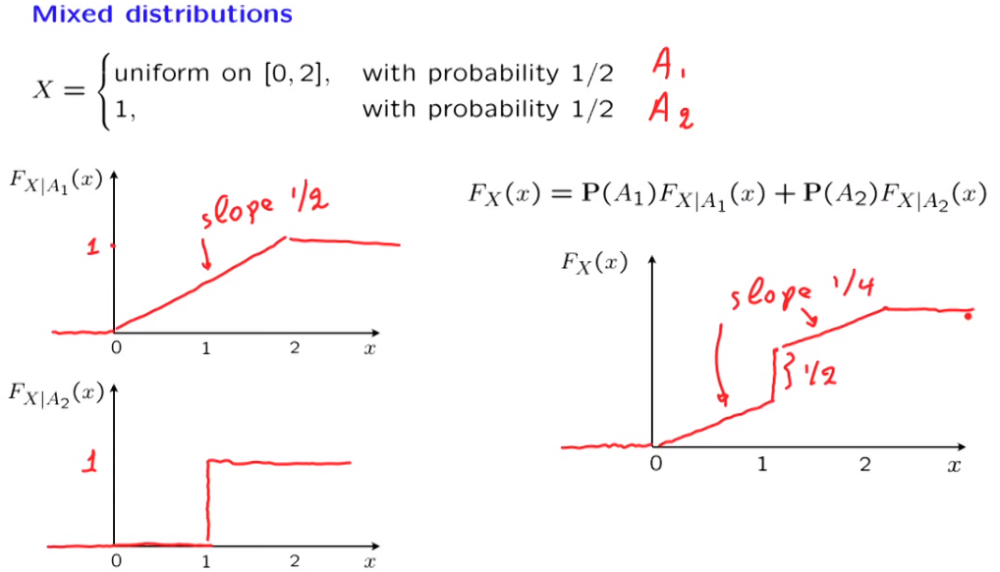

## Joint PDFs

Facts:
* it's not enough to have individual probabilities for defining joint probabilities, we also need joint PDFs.

The notation for the joint PDFs is similar to the one for joint PMFs
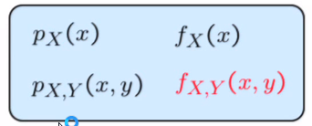

Value of joint PDF compared with joint PMF:

Sums are replaced by integrals, and the double integral gives a volume over a sheet of probability spread across a surface. This isn't a product of a proof, just

Two random variables are **jointly continuous** if they can be described by a joint PDF.

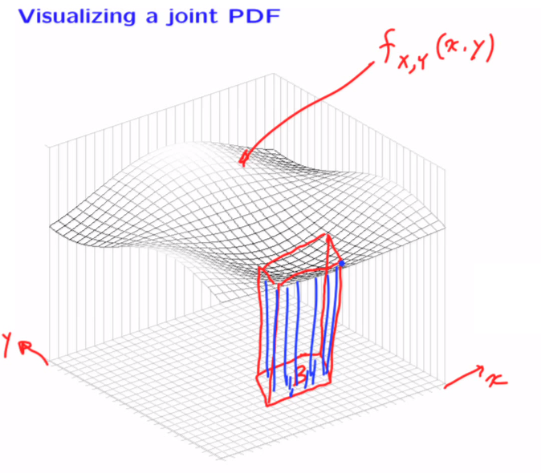

This volume above $B$ is exactly what the joint PDF calculates.

Joint PDFs can be examined concretely and more easily using a rectangle example:

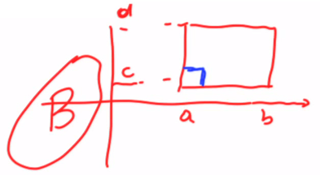

\[
\pr{a\le X \le b, c \le Y \le d} = \int_c^d \iint{ \int_a^b \iint{ \pdf{X,Y}{x, y} }{x} }{y}
\]

and the probability of the little square with side $\delta$ is

\[
\pr{a \le X \le a + \delta, c \le Y \le c + \delta} \approx \pdf{X,Y}{a,c}\cdot\delta^2
\]

So $\pdf{X,Y}{x,y}$ gives us the probability per unit area.

Something about joint curves having probability 0 because they only have area. Example incoming. Let $X = Y$, then consider their joint probability.

Because it is just a line they have 0 volume so their joint probability is 0 so they are not joint continuous. For joint continuity we need their relationship to be spread out. $\text{area}(B) = 0 \implies \pr{(X, Y)\in B} = 0$. i.e. the set $B$ needs to have some kind of area, can't just be a line or empty.

## From the joint to the marginal

First we can determine the form by following from the definition of the PMF and making our usual integral substitution.

But let's think through a proof. We will start with the CDF on $X$ and by its relationship to the PDF show that the equation above holds. What is the CDF on $X$?

If we think through a graphical example, we can figure how this could be represented algebraically

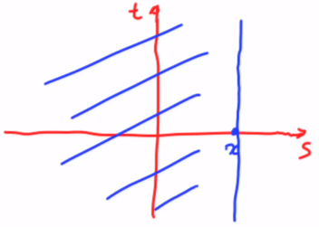

So the CDF is everything below some little $x$. To get that "everything", you can integrate the joint PDF across all possible values of the other symbol.

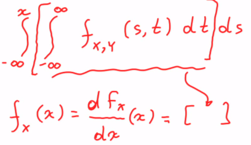

then since the PDF is just the derivative of the CDF and because of the fact below, it is just the inner integral.

Why: When we differentiate with respect to the upper limit of the integration, what we are left with is the integrand.

Question: Is the PDF requirement about single points just a statement about what happens when you take the integral over the fn at a single point, or something about the function itself? When we say PDF are we talking about the fn or the integral over the fn and the fn combined?

Example of recovering the marginal PDFs from the joint PDF:

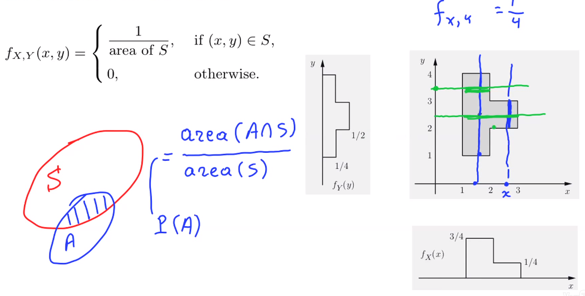

## Continuous analogs of various properties

For more than 2 random variables, just switch sums for integrals and pmfs with pdfs

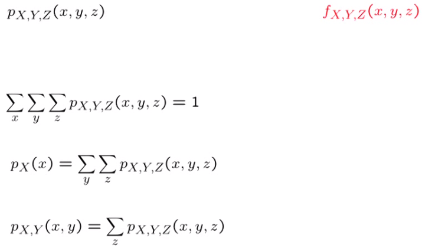

Functions of more than one random variable.

Make expected value rule and use that to show linearity of expectations.

## Joint CDFs

We know that we can recover the PDF of one variable from its CDF by taking the derivative, but now we consider two variables. How do we get the joint PDF?
We take the double integral across the CDF.

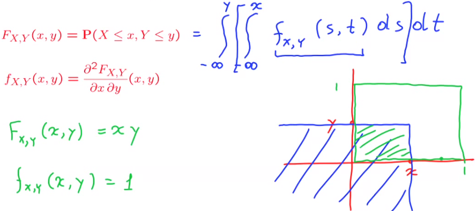
