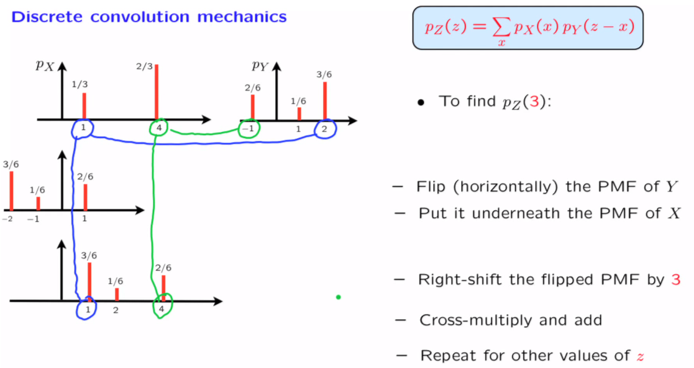
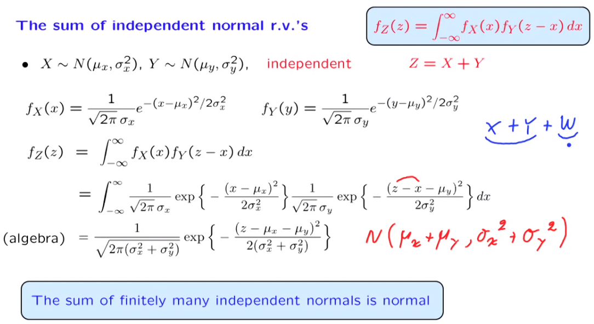
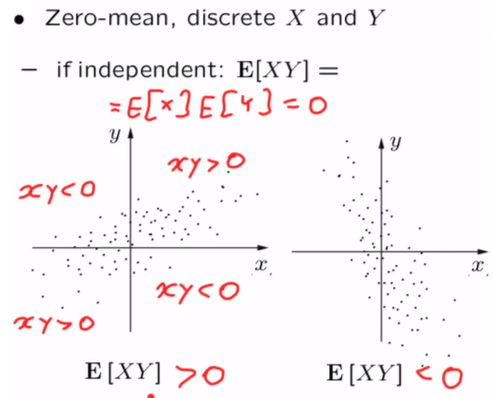
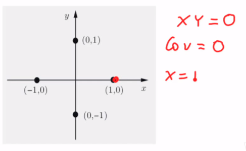
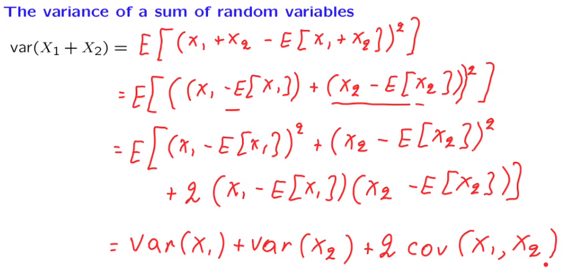
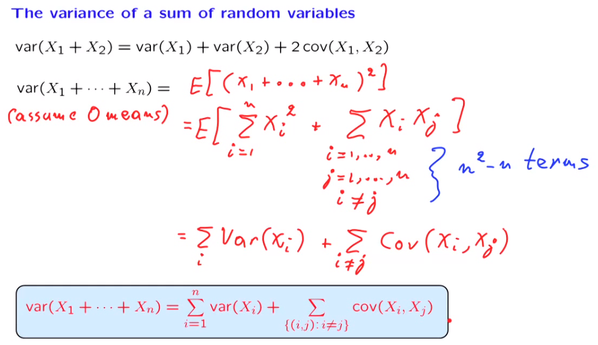
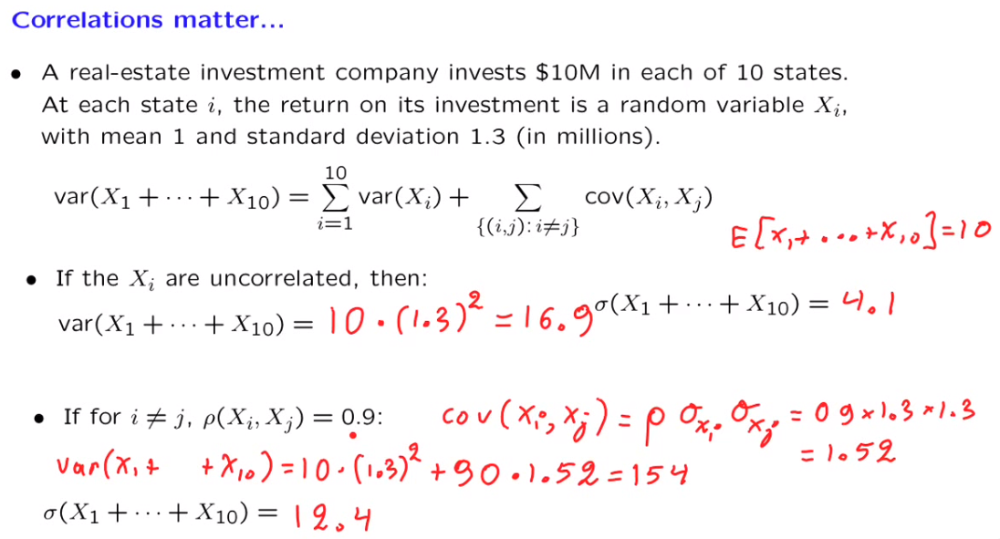

@import "../lib/macros.md"

# Lecture 12: Sums of independent r.v.s; Covariance and correlation

## Overview

Sum of independent random variables, which is based on derived distribution.
- discrete and cts
- helps prove sum of independent normals is normal

Covariance and correlation
- degree to which random variables are related

## Sum of independent discrete random variables.

Given:
* $X, Y$ are independent and discrete, with known PMFs.
* Let $Z = X + Y$. What is the PMF of $Z$?

Intuitively we want to sum over all $x, y$ pairs that equal some little $z$, but we can make a simplification by noticing that it would be necessary for $y = z - x$:

\[
\begin{align}
\pmf{Z}{z} &= \sum_x \pr{X = x, Y = z - x}\\
&= \sum_x \pmf{X}{x} \pmf{Y}{z - x}
\end{align}
\]

Then since $\pr{X = x, Y = z-x}$ is just the form of the joint PMF on $X, Y$ and they are independent, their joint PMF is equal to their product.

> The joint PMF is equal to the product when independent.

. Called the "Convolution formula" which takes two PMFs and outputs a new PMF.

A way to quickly carry out convolution check

Instead of going through all the combinations of numbers that add up to three in the straightforward way (loop and ask yourself for each number), just do the calculation on the graph itself to move $Y$ to the corresponding $X$s. That done, multiply values at the same entries.

## Sum of cts r.v.s

Let $Z = X + Y$ with $X, Y$ cts, independent, and with known PDFs.

What is the PDF of $Z$?
\[
\pdf{Z}{z} = \int_\ninfty^\infty \iint{ \pdf{X}{x} \pdf{Y}{z-x} }{x}
\]

Derivation of the PDF, start by conditioning on $X = x$. Then $Z = z + Y$, and if we take some value for $x$ like 3 then we have $Z = Y + 3$. Then
\[
\begin{align}
\cpdf{Z}{X}{ \cnd{z}{3} } &= \cpdf{Y + 3}{X}{ \cnd{z}{3} }\\
&= \pdf{Y + 3}{z}\\
&= \pdf{Y}{z - 3}
\end{align}
\]

For this we used what we knew from previous lectures that $\pdf{X + b}{x} = \pdf{X}{x - b}$.

which gives us the generalized formula $\cpdf{Z}{X}{ \cnd{z}{x} } = \pdf{Y}{z - x}$. Now we can use the multiplication rule and get the joint PDF: $\pdf{X,Z}{x,z} = \pdf{X}{x} \pdf{Y}{z - x}$ and then from the joint PDF go the the marginal:
\[
\pdf{Z}{z} = \int_\ninfty^\infty \iint{ \pdf{X, Z}{x, z} }{x}
\]

but in general this takes the same process of computation as in the discrete case.

the range of the integral can, in general, be pared down based on the behavior of the contained functions. Because the integral is just like a sum if you have a product with something that will be 0 over some range being integrated over then the value of the integral over that range would be zero.

## Sum of independent Normal r.v.s

For finitely many normal r.v.s the extension is just to use induction on something like $X + Y + W$.

Why is it important that sums of normal r.v.s are themselves normal?
Because it implies that when we start with normal r.v.s we're generally going to stay in that realm. Linear functions, linear combinations all will be normal still.

## Covariance

what are its properties, what is it an attribute of

What is covariance defined on?
Random variables

What does covariance measure?
Whether and how much two random variables move in the same direction.

Starting example:

If $X$ and $Y$ are independent then the expected value of their product is 0, because they have 0 mean. If not, then taking a discrete uniform distribution over the plots above give us a positive and negative expected value, respectively.

Generalize to encompass situations with nonzero mean, and continuous r.v.s

**Definition**

\[
\cov(X, Y) = \ex{ (X - \ex{X})\cdot(Y - \ex{Y})}
\]

What does the expected value look like with variables that have 0 mean?
$\ex{XY}$

What is the expected value?
Weighted average of values by the probability of having those values. For the discrete case it is weighted sum across all examples and for the cts case it is an integral product of the x and pdf.

What happens to independent variables with nonzero mean here?
Still 0 covariance since expectation is linear and independence

Does $\cov(X, Y) = 0 \implies x, y$ are independent?
No. As a counterexample, consider:

which are definitely not independent because known that $y$ or $x$ is 0 makes it so the other one isn't 0.

Useful facts:
- just because $X, Y, Z$ are mutually independent doesn't mean that $XY, XZ$ are.

## Covariance properties

Useful observations

1. $\cov(X, X) = \var{X}$
2. $\cov(X, Y) = \ex{XY} - \ex{X}\ex{Y}$, derivation:
\[
\begin{align}
\cov(X, Y) &= \ex{(X - \ex{X})\cdot(Y - \ex{Y})}\\
&= \ex{XY} - \ex{X\ex{Y}} - \ex{\ex{X}Y} + \ex{\ex{X}\ex{Y}}\\
&= \ex{XY} - \ex{X}\ex{Y} - \ex{X}\ex{Y} + \ex{X}\ex{Y}\\
&= \ex{XY} - \ex{X}\ex{Y}
\end{align}
\]

Next, covariance linearity. Assuming $X$ and $Y$ have 0 mean:
\[
\begin{align}
\cov(aX + b, Y) &= \ex{(aX+b)Y}\\
&= a \ex{XY} + b\ex{Y}\\
&=a\cdot\cov(X, Y)
\end{align}
\]
we assumed 0 mean, but this would be the same answer because the constant $b$ would result in no deviation in the other terms because if the $b$ is increased then the mean is also increased.

Next, covariance under addition: $\cov(X, Y + Z) = \cov(X, Y) + \cov(X, Z)$
\[
\begin{align}
\cov(X, Y + Z) &= \ex{X(Y+Z)}\\
&= \ex{XY} + \ex{XZ}\\
&= \cov(X, Y) + \cov(X, Z)
\end{align}
\]

$\cov$ is symmetric.

## Variance of sum of r.v.s

deriving for 2, working from the definition of the variance

> tip: know explicit mathematical definitions

derivation for $n$ random variables

The nonzero mean case is the same, but the derivation has more terms in the middle that end up getting cancelled.

The variance of the sum is the sum of the individual variances and their covariance. This kind of thing is

## Correlation coefficient

What is the definition of the correlation coefficient?
\[
\begin{align}
\rho(X, Y) &= \ex{ \frac{(X - \ex{X})}{\sigma_X} \cdot \frac{(Y - \ex{Y})}{\sigma_Y} }\\
&= \frac{\cov(X, Y)}{\sigma_X \sigma_Y}
\end{align}
\]

How does the correlation coefficient relate to the covariance?
It is a dimensionless version of the covariance

Why do we need the correlation coefficient?
Because the covariance is hard to interpret qualitatively, and has weird dimensions (m^2, for example)

What is the range of the correlation coefficient?
-1, 1

Why is it important that the correlation coefficient has a definite scale?

For what kidns of random variables is the correlation coefficient undefined?
Ones with 0 std dev.

What does it mean when $\rho = 0$?
Two variables are uncorrelated.

Some sample situations:
correlation coefficient of a variable with itself is 1 (because it would be variance over variance)

c.c. of a var with -var is -1

if two variables are exactly linearly related then abs($\rho$) = 1

One great property of $\rho$ is that it is invariant under some linear operation, up to sign.

Example is temperature correlation with some other random variable, it doesn't matter what units the temperature is in because they're all convertible to one another via a linear function.

> Example with $X$ and $X^3$, even though they are totally dependent, their correlation coefficient was moderate at $\sqrt{\frac{3}{5}}$

## Derivation of key properties of the correlation coefficient

Proofs of properties of the correlation coefficient.

Proof $-1 \le \rho \le 1$:

$\ex{X^2} = 1$ in the first line because we assumed zero mean, so the second term of $\var{X} = \ex{X^2} - (\ex{X})^2$ would be zero and we also assumed unit variance so it is 1.

Logic chain for $\abs{\rho} = 1$ implying dependence:

Because the expected value of the previous equation is equal to $1 - \rho^2$, if $\abs{\rho} = 1$ then the expected value is 0, but then because the value in the expected value is always positive (because it is squared), then that means it must be 0 with probability 1. But that means that either $X = Y$ or $X = -Y$.

The algebra is similar for the general case, but this only shows zero mean and unit variances.

This $\rho$ example shows an extreme form of dependence.

What does $\abs{\rho} = 1$ between two r.v.s imply?
They are linearly dependent.

## Interpreting the correlation coefficient

If $X, Y$ have a high $\rho$, does that imply that one caused another?
No.

What does the correlation coefficient measure?
The degree of association between two r.v.s.

Why might two random variables be related? Give an example.
Some other variable. Take the example of math and musical ability. They may coexist in a large number of cases but that doesn't mean one causes the other. Maybe they both exercise a similar part of the brain and that development helps in both areas.

What does correlation between random variables often imply?
Underlying, common, hidden factor affecting both.

Example 12.9, calculating coefficient with sum

## Correlations matter

This example offers several things:
1. Real-world example of using a probability model (independent random variables) to model combined risk/return on housing markets.
2. Showing how correlation coefficient can impact real attributes of that model (like variance), and how assumptions about correlation can lead to underestimating potential losses.

