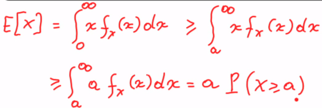
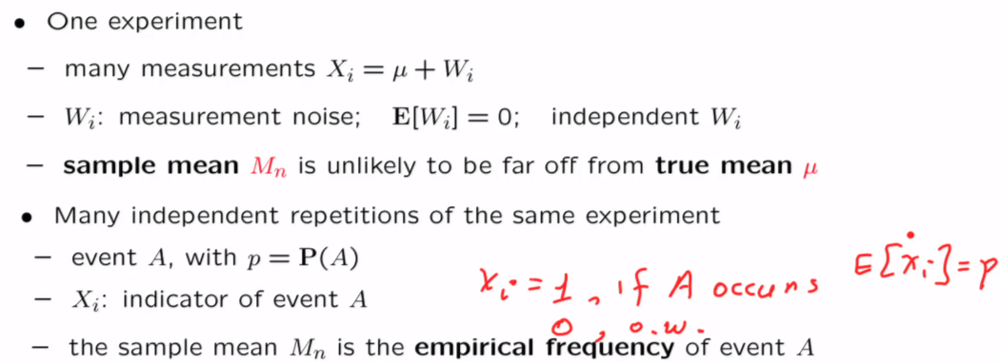
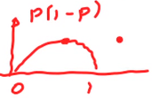
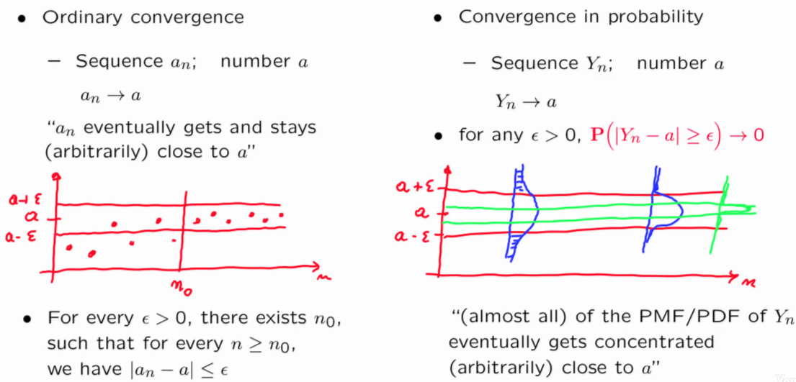
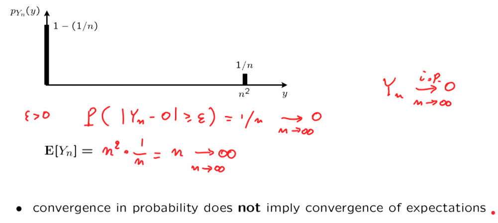
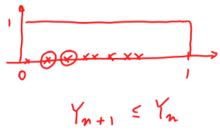

# Inequalities, convergence, and the Weak Law of Large Numbers

$\newcommand{\ex}[1]{\mathbf{E}\left[#1\right]}$
$\newcommand{\pr}[1]{\mathbf{P}\!\left(#1\right)}$
$\newcommand{\abs}[1]{ \left|#1\right| }$
$\newcommand{\unfrm}[2]{ \mathcal{U}\left( #1, #2 \right) }$

## Overview

Goal: Lean and understand the Weak law of large numbers (WLLN)

To support that goal, learn about the **Markov** and **Chebyshev** inequalities.

The **sample mean** is an application that can use these inequalities and we look at an example in the context of **polling**.

We also define **convergence** in probability.

## The Markov inequality

extrapolate probablility of extreme events from some bit of information about the r.v.

$\ex{Y} \le \ex{X}$ because the inequality between $X$ and $Y$ holds across their whole range.

bound aabove the value for fn
tail behavior
a bound is strong/ good if it is somewhat close to the actual bound.

this one is not very strong since the value falls off exponentially but the bound falls of as a factor of $/frac{1}{a}$

In this case we have to make adjustment for the r.v. not being strictly $\ge 0$

and we can also hone in on a closer bound by recognizing symmetry

## The Chebyshev inequality

derivation:

examples:

exponential r.v. example:

why is the chebyshev inequality more informative than the markov inequality?
it uses more information about the r.v.

The Chebyshev inequality is stronger when $a$ is large, but it is possible to get a lower bound with the Markov inequality.

## Weak law of large numbers

essentially, the average of the sum of a sequence of i.i.d. r.v.s converges to the expected value of the unknown.

long experiment where we select a lot of r.v.s

we consider $M_n$ to be a random variable and ask some questions about it

what is its expected value and variance

which we then use with the chebyshev inequality to see that

so as the number of selected samples grows the deviation from the true mean is going to become smaller

## Polling

Some referendum is going to take place. We assume that people will not change their mind and we seek to identify the fraction $p$ of the population that will vote "yes".

Select people uniformly and independently. Let $X_i$ be an indicator that the $i$th person said yes. Then $\ex{X_i} = p$

Give me the exact answer

No can do.

Give me an answer that is guaranteed to have a small error

Can't do that either (why? because your sample might not be representative)

What I can do is give you an answer where the probability of error is small with high probability.

for $n = 10000$

We don't know what $p$ is but we can plot it:

so the maximum this value can be is 1/2 which makes the value 1/4, 25% chance of error. If we want a smaller chance of error, then

two parameters:
* accuracy you want
* the confidence of the accuracy

50,000 people is a lot but it is what is required to get our confidence. There are things that can be done to reduce this requirement, like going for a slightly larger probability of error (3%). Another option is to use a more accurate bound than the Chebyshev inequality.

## Convergence in probability

For the WLLN we want to simplify and say that $M_n$ converges to $\mu$, but we need to define "convergence" here.

A sequence $Y_n$ converges in probability to a number $a$ if for any $\varepsilon > 0$
\[
\lim_{n\to\infty}\pr{\abs{Y_n - a} \ge \varepsilon} = 0
\]

comparing to ordinary convergence

Suppose that $X_n \to a, Y_n \to b$ in probability, then

1. if $g$ is continuous, then $g(X_n) \to g(a)$
2. $X_n + Y_n \to a + b$
3. $\ex{X_n}$ need not converge to $a$

## Convergence in probability examples

convergence in probability has to do with the bulk of the distribution, whereas the expectation is sensitive to high-valued tails.

Next consider $X_i \sim \unfrm{0}{1}$. Does this converge?

No, because it does not settle down after many trials.

But what about $Y_n = \min\{X_1, \ldots, X_n\}$.

The first step is to make an educated guess about what the limit may be, the value that the sequence may converges to.

Write the expression for the value being epsilon away from the limit, then calculate the probability, either directly or by trying to bound it somehow and show that the bound goes to 0.

## Related topics

How far can the given topics be taken?

Better bounds on tail probabilities:
* Chernoff bound

but it requires addtl  assumptions

also using central limit theorem - $M_n \sim N(\mu, \sigma^2/n)$, as if it is normal

different types of convergence.
* convergence in probability
* convergence with probability 1 - seqce of r.v.s and another r.v.

that a given $\omega$ is the same as the $Y$ in

strong law of large numbers

convergence of a sequence of distributions (CDFs) to a limiting CDF. - convergence in distribution.
