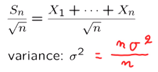
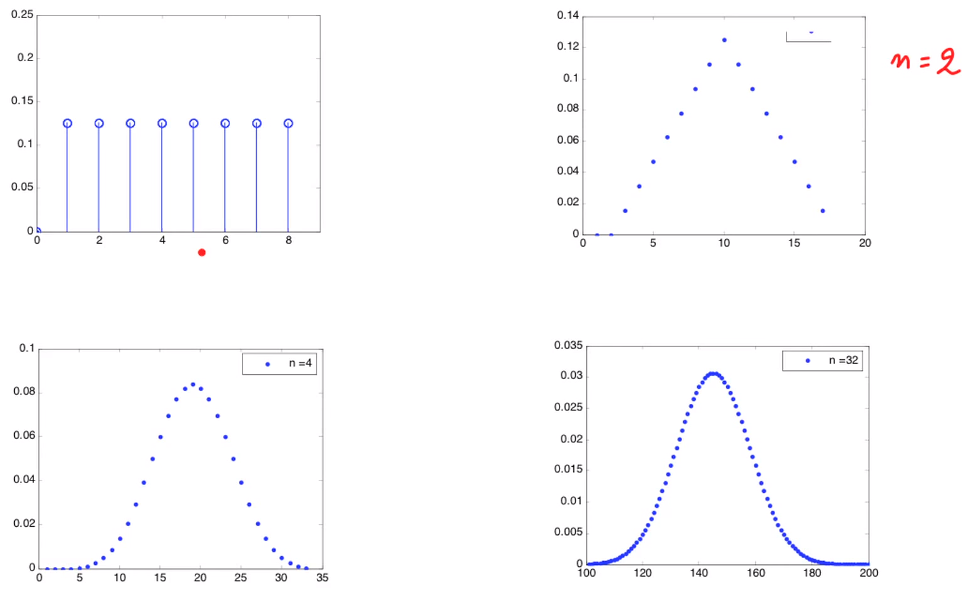
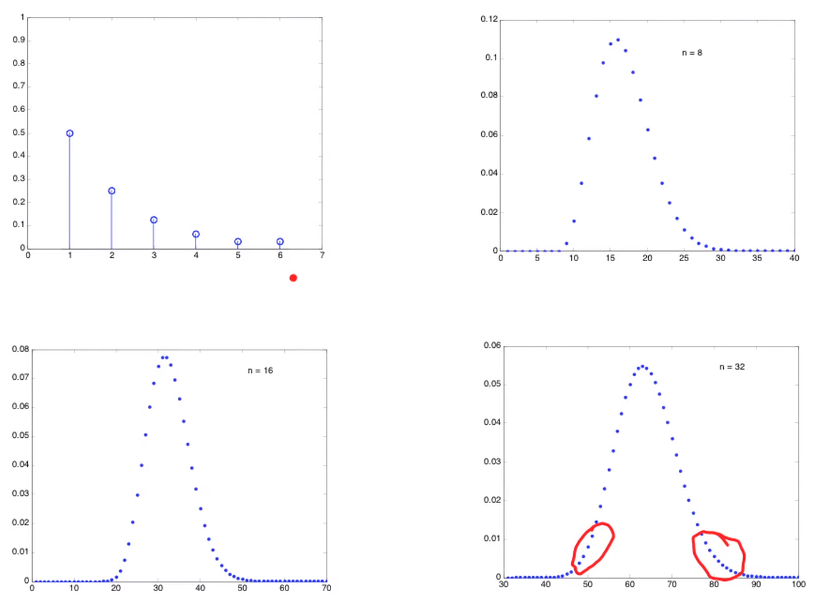
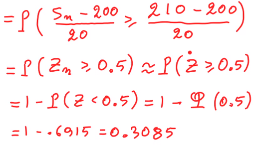
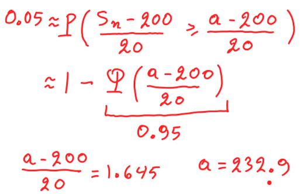
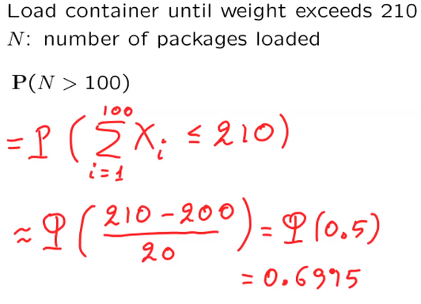
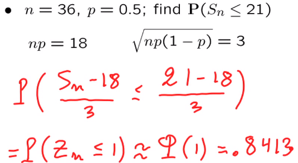
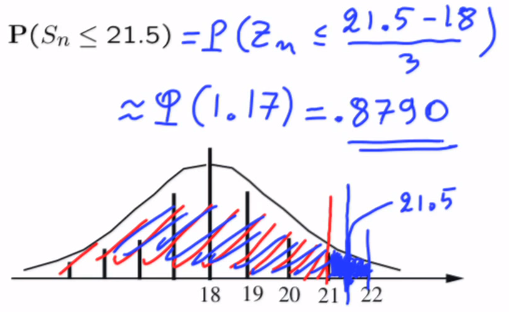
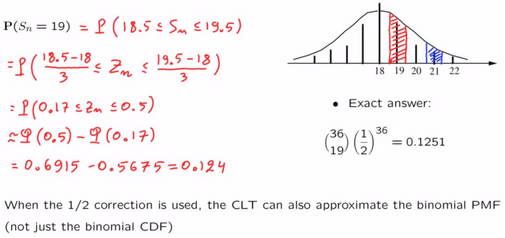
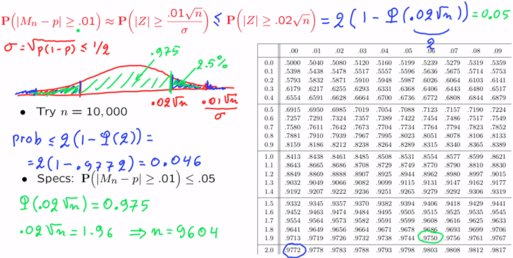

@import "../lib/macros.md"

# The Central Limit Theorem

## Overview

CLT states that the sum of a sequence of i.i.d. r.v.s is normally distributed
1. precise statement
2. universal result
3. many examples
4. refinement for discrete r.v.s
5. application to polling

much more informative

## The Central Limit Theorem

Let $X_1, \ldots, X_n$ be i.i.d. with mean $\mu$ and variance $\sigma^2$, distributed according to

Given $S_n = X_1 + \cdots + X_n$, we have a variance of $n\sigma^2$ and a graph that looks like

In the last lecture we looked at the sample mean as a r.v with the form $M_n = \frac{S_n}{n} = \frac{X_1 + \cdots + X_n}{n}$ with cariance $\frac{\sigma^2}{n}$ which goes to 0 as $n$ gets large. This distribution is trivial, it just clumps around some small central point

This similar variance and similar image bring up interesting questions. Does this approach a "limiting shape"? What is the shape approached?

First, we introduce another random variable based on our previous reasoning but with a few nicer properties. Nice properties here include:
* distribution doesn't move with additional terms added
* variance 1

\[
Z_n = \frac{S_n - n\mu}{\sqrt{n}\sigma}
\]

Now, let $Z \sim N(0, 1)$, the **central limit theorem** states that for every $z$,
\[
\lim_{n\to\infty}\pr{Z_n \le z} = \pr{Z \le z}
\]

For evaluating, since the value on the right is just the std normal CDF $\Phi(z)$, we can calculate the left using standard normal tables.

How to interpret it
what it means
how we use it
examples

## Discussion of the CLT

Universal and easy to apply, only means and variances matter
fairly accurate computational shortcut - what's the alternative?  
convolve it with itself $n$ times

justifies models involving normal random variables - the overall effect of multiple noisy sources is that of a normal random variable even if they are very different from normal

* CDF of $Z_n$ converges to a normal CDF
* some results exist for convergence of PDFs/PMFs. but need more assumptions

> try removing assumptions in math contexts

* we can work without assuming identically distributed $X_n$ but we need assumptions about means and variances
* versions of CLT exist for "weak dependent" situations. weak dependence is where there is some dependence on $X_i$ that are near each other but others further apart are essentially independent.
* proof uses "transforms": Show $\ex{e^{sZ_n}} \to \ex{e^{sZ}} for all $s$, then appeal to deep results to show that if that is true then the CDF also converges.

Practically, we just treat $Z_n$ as if it is normal. Then since $S_n = \sqrt{n}\sigma Z_n + n\mu$ is just a linear fn of a normal r.v. we can treat it as if it is normal directly, $S_n \sim \norml{n\mu, n\sigma^2}$

How big does $n$ have to be to use it? Not large ($n = 30$), but it helps if the $X_i$s "look normal" (e.g. symmetric and unimodal).

**unimodal**: single-peaked

## Exercise: CLT applicability

Consider the **class average** in an exam in a few different settings (imagine a multiverse where many classes of students are in the given situation and we want to know the distribution of the class average across these universes). In all cases, assume that we have a large class (i.e. $n$ being small is not a consideration) consisting of equally well-prepared students (i.e. the scores of the students are i.i.d.). Think about the assumptions behind the central limit theorem, and choose the most appropriate response under the given description of the different settings.

All answers are either:
* class average is approximately normal
* not approx normal because student scores are strongly dependent
* not approx normal because student scores are not identically distributed

1. Consider the class average in an exam of a fixed difficulty.

Since the students are equally well-prepared there is no problem here, approx normal.

2. Consider the class average in an exam that is equally likely to be very easy or very hard.

I thought this was approximately normal because I was concentrating on the students grades and thinking that they were still conditionally independent given the test score. Reframing as in the description, thinking about multiple realities with students taking tests it's straightforward to see that because the test being hard/easy is a r.v. that applies to all students then their grades (and by extension the class average) is dependent and CLT does not apply.

3. Consider the class average if the class is split into two equal-size sections. One section gets an easy exam and the other section gets a hard exam.

I thought this was not normal because the scores would not be identically distributed, again concentrating on the student scores instead of the average. This one actually is normal, because the class average can be constructed as an average of r.v.s of the form $\frac{Y_i + Z_i}{2}$ where $Y$ was in the first section and $Z$ was in the second. These will be identically distributed.

4. Consider the class average if every student is (randomly and independently) given either an easy or a hard exam.

This one seemed more straightforward even if concentrating on the distribution of the scores of the students. Random and independent assignment into the test group means that the score of a student can just be modeled in the usual way. Their distributions will be identical and they are still independent since the assignment was independent (so at the onset their individual scores had the same potential).

## Illustration of the CLT

for convolution see lec 12

In both examples a r.v. is constructed as the sum of identical and independent r.v.s with the given distribution. The dots represent the probability of the sum at discrete points.

Example with a discrete uniform

convolving with itself

The operation rapidly approaches convergence.

For a truncated geometric distribution it is a bit different,

Even at $n = 32$ there is still some asymmetry.

## CLT Examples

CLT helps us say that the sum of some $n$ i.i.d. variables is less than $a$ with a certain probability $b$. Missing 1 of these helps us generate the kinds of questions we can answer.

### Example 1

The idea is to get the probability into the same form as $Z_n$ and then use the normal table.

### Example 2

essentially choose the probability that results in what you need and then solve for $a$

### Example 3

### Example 4

## Normal approximation to the binomial

true value using the binomial CDF: 

which is pretty close but we can do better

because $S_n$ is discrete these choices are all the same but it makes a difference when we recast the binomial as a normal r.v.

The answers in this case are very close. We can also use this property to approximate the probability of individual values in a binomial distribution.

## Polling Revisited

Comparing results and bounds of estimation using CLT instead of Chebyshev inequality.

Recall that $M_n = \frac{S_n}{n}$ and the following facts about bernoulli r.v.s

We would like to say that we have a small error, $\abs{M_n - p} < 0.01$, but we can't without $p$. The best we can do is try to minimize the quantity $\pr{\abs{M_n - p} \ge 0.01}$.

Recall that the CLT is a statement about $Z_n$, so we need to represent our probability in terms of $Z_n = \frac{S_n - n\mu}{\sqrt{n}\sigma}$. $S_n$ is just the sum of random variables, so we can write

\[
\begin{align}
0.01 &\le \abs{M_n - p}\\
&\le \abs{\frac{S_n}{n} - p}\\
&\le \abs{\frac{S_n}{n} - \frac{np}{n}}\\
&\le \abs{\frac{S_n - np}{n}}\\
\frac{0.01\sqrt{n}}{\sigma}&\le \abs{\frac{S_n - np}{\sqrt{n}\sigma}}\\
&\le \abs{Z_n}
\end{align}
\]

as required. So then we call on the CLT and observe

One problem with our inequality is that is depends on $\sigma$ which involves the unknown $p$.

Set an upper bound
It is the sum of both tails because it is absolute value
Colors correspond to steps, blue for blue question, green for green.

How does this compare with the real world? In practice polls generally use about 1000 people because their requirements are not as strict, they usually go for about a 3% margin of error.
